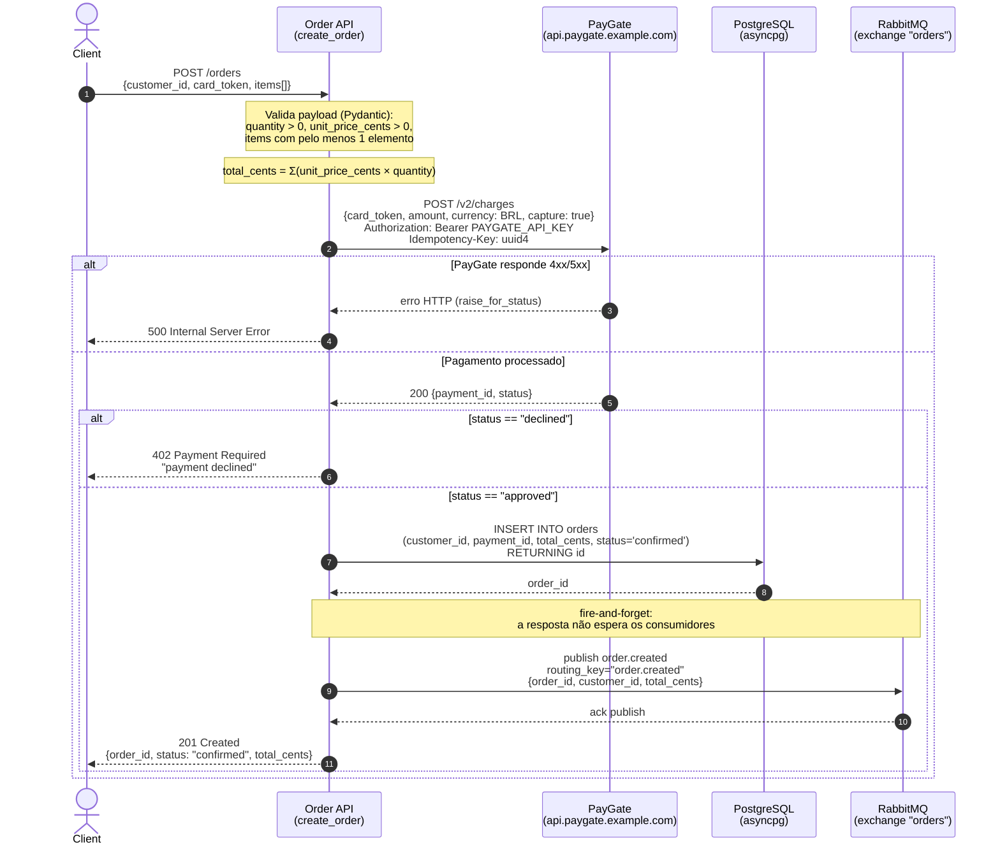

Aqui está o diagrama de sequência do fluxo `POST /orders`, baseado no código real do serviço (`main.py`, `payments.py`, `db.py`, `events.py`). É só colar no README.

## POST /orders — Sequência

## Notas extraídas do código

- Endpoint: `POST /orders`, status de sucesso `201` (`main.py:23`).
- O total é calculado no app, não vem do cliente: `total_cents = sum(i.unit_price_cents * i.quantity ...)` (`main.py:25`).
- Validação de entrada via Pydantic: `quantity > 0`, `unit_price_cents > 0`, e `items` com no mínimo 1 item (`main.py:11-20`).
- Cobrança via PayGate em `POST /v2/charges` com `currency: "BRL"`, `capture: True`, header `Authorization: Bearer` (env `PAYGATE_API_KEY`) e um `Idempotency-Key` gerado por requisição (`payments.py:15-30`).
- Erros 4xx/5xx do PayGate viram `500` na nossa API, porque `resp.raise_for_status()` propaga a exceção (`payments.py:13,29`).
- Pagamento `declined` retorna `402` com detalhe `"payment declined"` (`main.py:28-29`).
- Persistência: `INSERT INTO orders (...) VALUES (..., 'confirmed') RETURNING id` via pool asyncpg, devolvendo o `order_id` (`db.py:15-27`).
- Publicação do evento `order.created` no exchange `orders` do RabbitMQ com `routing_key="order.created"` e payload `{order_id, customer_id, total_cents}` (`events.py:7-25`).
- A publicação é explicitamente fire-and-forget: a resposta da API não aguarda os consumidores (`main.py:33-34`).
- Resposta final: `{order_id, status: "confirmed", total_cents}` (`main.py:36`).
