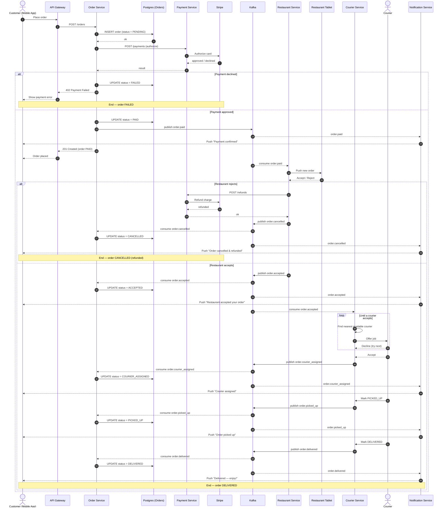
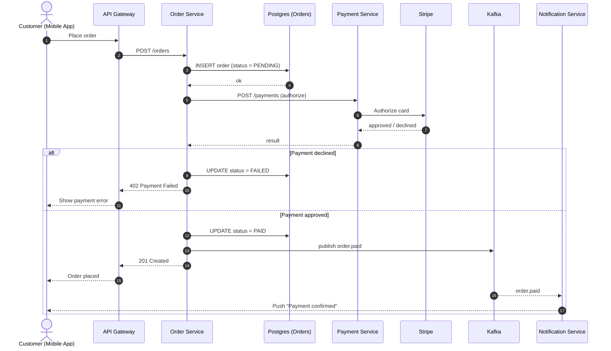
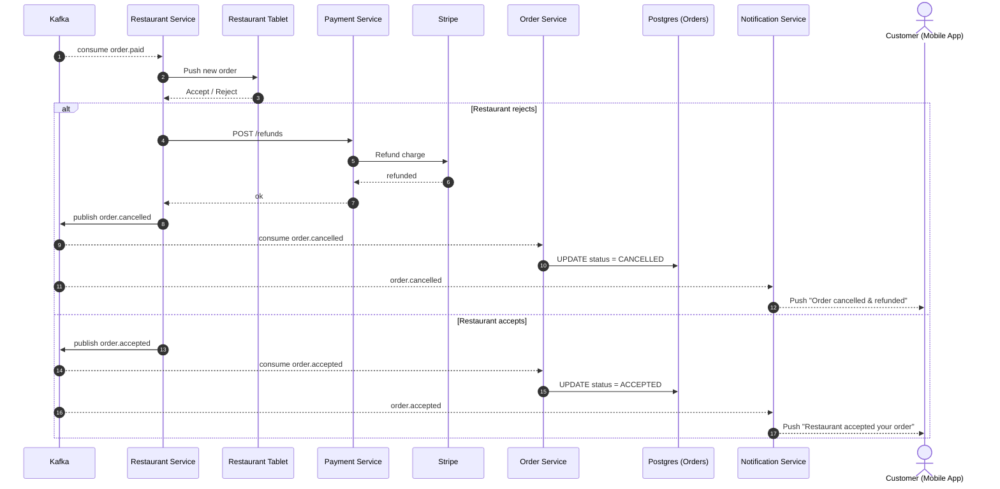
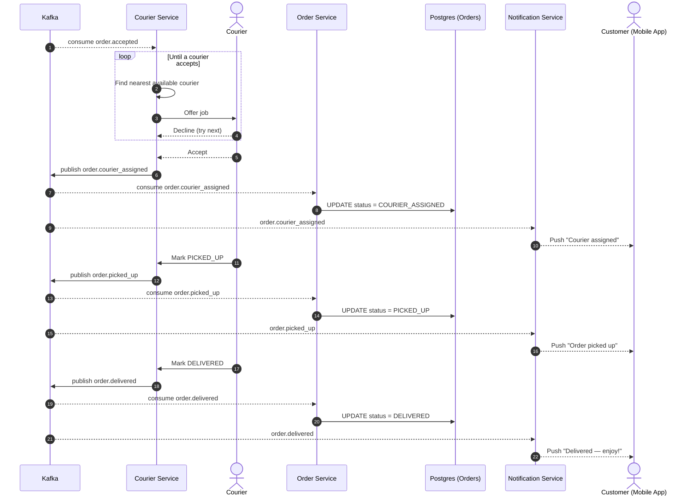

# Food Delivery — Order Lifecycle

This page documents the end-to-end lifecycle of a food delivery order, from the moment a customer places it in the mobile app through to delivery (or one of the failure branches along the way).

The flow is an event-driven **saga**: each service owns one step, persists its own state, and either calls the next service synchronously (for payment) or emits a Kafka event (`order.*`) that downstream services consume. The Notification Service listens to every `order.*` event and pushes the customer an update at each stage.

> All diagrams below are Mermaid `sequenceDiagram` blocks and render natively on GitHub.

## 1. End-to-end overview (with failure branches)

## 2. Focused view: Place order & payment

## 3. Focused view: Restaurant accept/reject

## 4. Focused view: Courier assignment, pickup & delivery

## Notes & assumptions

A few details weren't fully specified, so the diagrams make these reasonable, clearly-labelled choices. Adjust if your implementation differs:

- **Order status enum.** Uses `PENDING → PAID → ACCEPTED → COURIER_ASSIGNED → PICKED_UP → DELIVERED`, plus terminal `FAILED` and `CANCELLED`. Only `PENDING`, `FAILED`, `CANCELLED`, `PICKED_UP`, and `DELIVERED` were named explicitly; the intermediate states are inferred from the notification stages you listed.
- **Canonical order state.** I assumed the Order Service is the system of record and updates Postgres in response to downstream Kafka events. If each service keeps its own state with no central order projection, drop those Order Service/Postgres update arrows.
- **Event names.** `order.paid` and `order.accepted` were specified. I named the others (`order.cancelled`, `order.courier_assigned`, `order.picked_up`, `order.delivered`) to match the `order.*` pattern the Notification Service subscribes to. Rename to fit your conventions.
- **Refund vs. void.** On rejection I show a refund per your description; if payment was only *authorized* (not captured), this is typically a void of the authorization instead — worth confirming against the Payment Service API.
- **API Gateway in async parts.** The gateway only appears on the synchronous request/response path. Once the saga goes async over Kafka, the app receives updates via push notifications, not the gateway.
