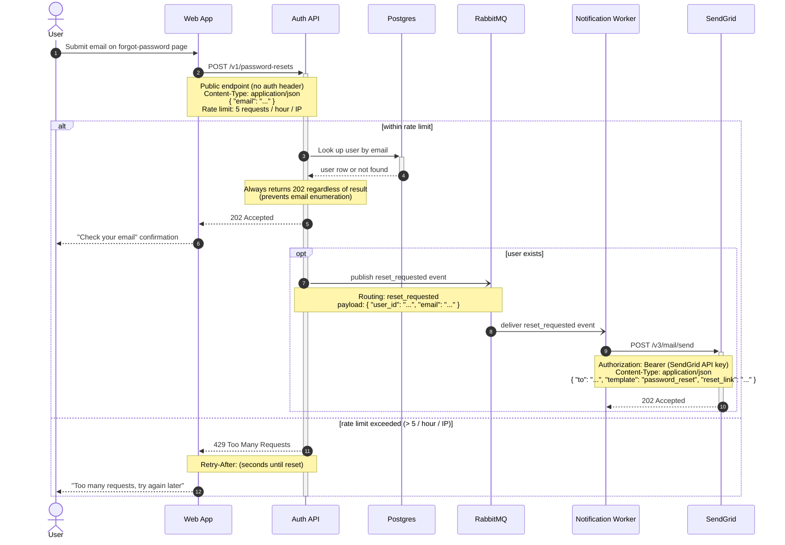

Here is the password reset flow as a Mermaid sequence diagram. It covers the happy path (email enumeration-safe 202 + async email delivery) and the rate-limit case (429). Paste it straight into your GitLab wiki — GitLab renders ` ```mermaid ` blocks natively.



Walking through it: the user submits their email (1) and the Web App calls the public, rate-limited `POST /v1/password-resets` (2). Inside the rate limit, the Auth API looks the user up in Postgres (4–5) and **always** answers `202 Accepted` (7) so attackers can't enumerate emails (8 confirms to the user). Only if the user actually exists does the Auth API fire-and-forget a `reset_requested` event onto RabbitMQ (9), which the Notification Worker consumes (11) and turns into a `POST /v3/mail/send` to SendGrid with a `Bearer` token (12). If the caller is over 5 requests/hour/IP, the Auth API short-circuits with `429 Too Many Requests` plus a `Retry-After` header (15). The `-)` arrows mark the RabbitMQ hops as async; everything else is request/reply.

A note on validation: I could **not** validate this diagram in the current environment — the Mermaid MCP server returned a transport error and the local mermaid-cli has no headless Chrome available to render, so I did not install anything to force it through. The syntax here sticks to Mermaid's portable core (participants/actors, `alt`/`opt`, notes, activations, `-)` async arrows), all of which GitLab's bundled Mermaid supports. To preview or tweak it before publishing, paste the block into <https://mermaid.live>.
