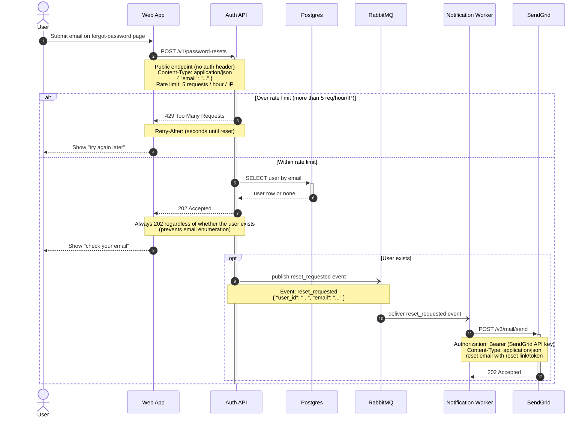

Here's the password reset flow as a Mermaid sequence diagram. It renders natively in your GitLab wiki — paste it into a page as-is. It covers the happy path, the email-enumeration protection (always 202), and the rate-limit case (429 + `Retry-After`), with notes carrying the endpoints, headers, and payloads you described.

Reading the flow by step number: the user submits their email (1) and the web app POSTs it to the public, rate-limited `/v1/password-resets` endpoint (2). If that IP is over 5 requests/hour, the API returns `429` with a `Retry-After` header (3) and the user is told to try later (4). Otherwise the API looks the user up in Postgres (5–6) and always returns `202 Accepted` (7) — identical whether or not the account exists, so attackers can't enumerate emails — and the user is told to check their inbox (8). Only when the user actually exists does the API publish a `reset_requested` event to RabbitMQ (9); the Notification worker consumes it (10) and sends the reset email via SendGrid's `POST /v3/mail/send` using a `Bearer` token (11–12).

A note on validation: I could not validate the render here. The connected Mermaid MCP server returned a transport error, and the local mermaid-cli can't render in this environment (no headless Chrome). The code uses only portable, safe-core Mermaid syntax, so GitLab will render it natively; if you'd like a preview before publishing, paste it into <https://mermaid.live>.

I left two things implicit because you didn't specify them, and they're easy to add if you want them in the diagram: what happens if the SendGrid call fails (non-202), and any failure path for the RabbitMQ publish/consume. Say the word and I'll add those branches.
