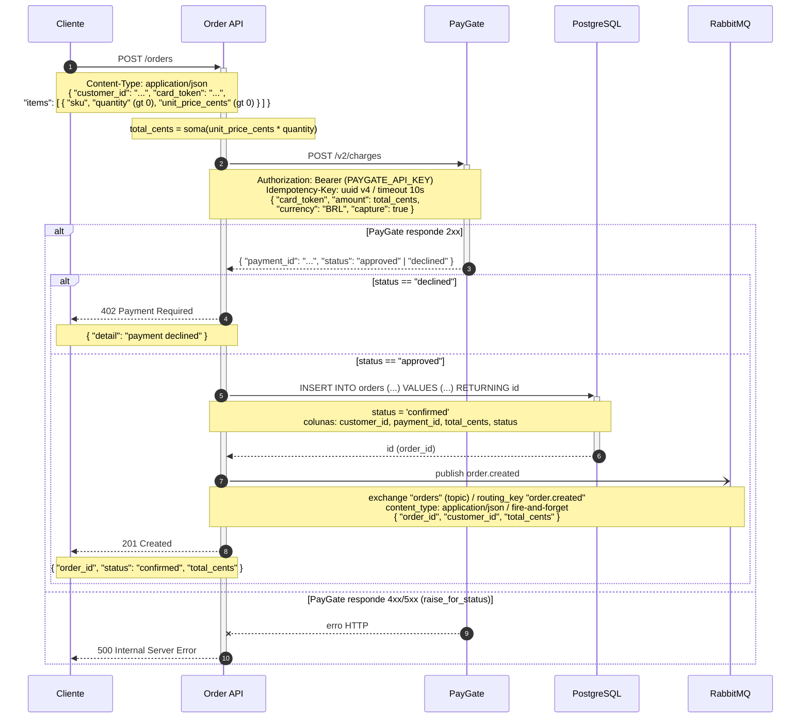

Li o código real em `evals/files/order-api` (`main.py`, `payments.py`, `db.py`, `events.py`) e montei o diagrama de sequência do `POST /orders` com os detalhes que estão de fato no código. Pode colar direto no README — GitHub e GitLab renderizam blocos ```mermaid``` nativamente.



Passo a passo do fluxo:

1. O cliente chama `POST /orders` com `customer_id`, `card_token` e `items` (o Pydantic valida `quantity > 0`, `unit_price_cents > 0` e ao menos 1 item).
2. A API calcula `total_cents` somando `unit_price_cents * quantity` de cada item.
3-4. Chama o PayGate em `POST /v2/charges` (header `Authorization: Bearer` com `PAYGATE_API_KEY`, `Idempotency-Key` uuid v4, timeout de 10s) e recebe `payment_id` + `status`.
5-6. Se `status == "declined"`, a API responde `402` com `{"detail": "payment declined"}`.
7-9. Se aprovado, grava o pedido no Postgres (`INSERT ... RETURNING id`, com `status = 'confirmed'`) e recebe o `order_id`.
10. Publica `order.created` no RabbitMQ — exchange `orders` (topic), routing key `order.created` — em modo fire-and-forget (a resposta não espera os consumidores).
11. Responde `201 Created` com `{ order_id, status: "confirmed", total_cents }`.
12. Se o PayGate retornar 4xx/5xx, o `raise_for_status()` faz a exceção subir e o cliente recebe `500` (caminho que o próprio código documenta no docstring do `charge`).

Observação sobre validação: o servidor Mermaid MCP estava retornando erro de transporte ("Invalid Request" / JSON-RPC -32600) e o `mermaid-cli` local não consegue renderizar neste ambiente (falta o Chrome do puppeteer). Não instalei nada para contornar isso, então **o diagrama não foi validado aqui** — mas a sintaxe usa só o núcleo portável do Mermaid; cole no README e o GitHub/GitLab renderizam direto, ou jogue em <https://mermaid.live> para pré-visualizar e editar.
