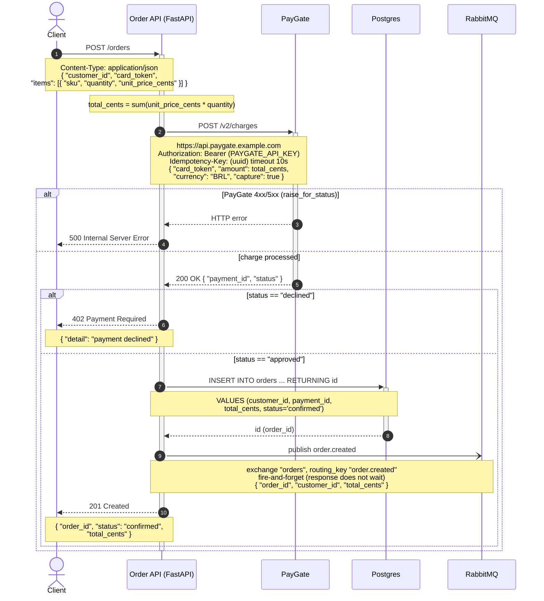

Li o código da API de pedidos (`main.py`, `payments.py`, `db.py`, `events.py`) e montei o diagrama a partir do fluxo real do handler `create_order` em `POST /orders`. Pode colar direto no README — GitHub e GitLab renderizam blocos ```mermaid``` nativamente.



Passo a passo do fluxo:

1. O cliente faz `POST /orders` com `customer_id`, `card_token` e a lista de `items`.
2. A API calcula `total_cents` somando `unit_price_cents * quantity` de cada item.
3. Chama o PayGate em `POST /v2/charges` (passos 3–4), com `Idempotency-Key` por requisição e timeout de 10s.
4. Se o PayGate responde 4xx/5xx, o `raise_for_status()` levanta exceção e a API devolve **500** (passos 5–6).
5. Com a cobrança processada, se o `status` for `declined` a API devolve **402 payment declined** (passos 8–9); se for `approved`, grava o pedido no Postgres com `status='confirmed'` e recebe o `id` (passos 10–12).
6. Publica `order.created` no RabbitMQ (exchange `orders`, routing key `order.created`) de forma **fire-and-forget** — a resposta não espera os consumidores (passo 13) — e por fim devolve **201** com `order_id`, `status` e `total_cents` (passo 14).

Sobre validação: tentei validar pelo servidor MCP do Mermaid (retornou erro de transporte "Invalid Request") e pelo mermaid-cli (versão 11.15.0 instalada, mas o render falha com "Could not find Chrome" — sem navegador headless no ambiente). Ou seja, **o diagrama não foi renderizado/validado aqui**. Usei só sintaxe do núcleo portável (compatível com as versões do GitHub/GitLab), então deve renderizar sem problema; se quiser pré-visualizar e editar, é só colar o bloco em <https://mermaid.live>.

Observação sobre os caminhos de erro: incluí os dois que estão de fato no código — o **402** explícito (`if payment["status"] == "declined"`) e o **500** documentado no docstring do `charge` ("PayGate 4xx/5xx responses raise and bubble up as a 500"). Não inventei outros modos de falha (ex.: erro ao salvar no banco ou ao publicar no RabbitMQ não estão tratados no código, então ficaram de fora).
