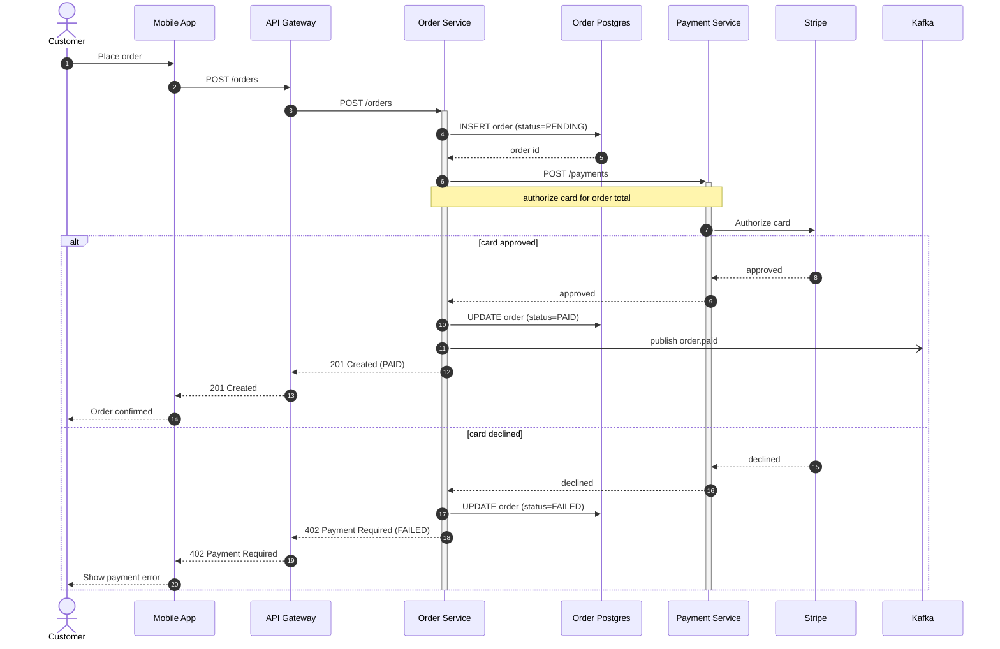
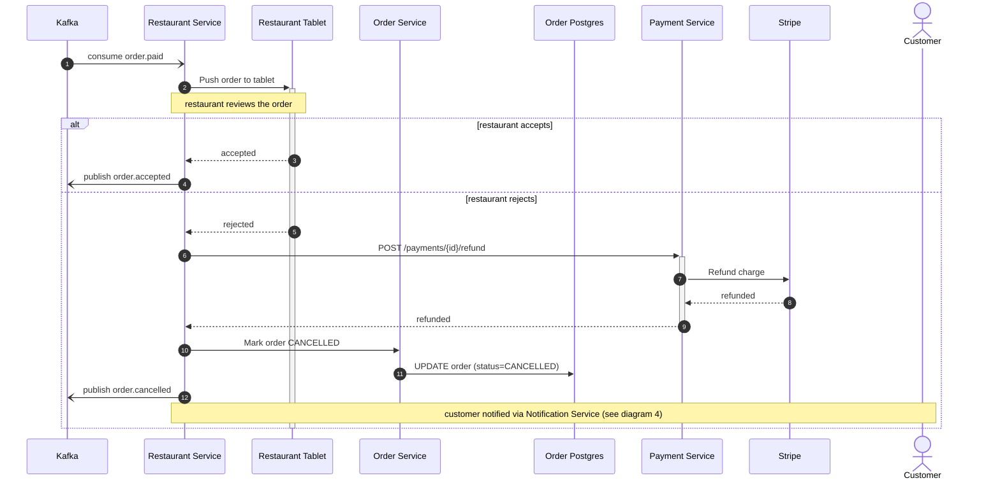
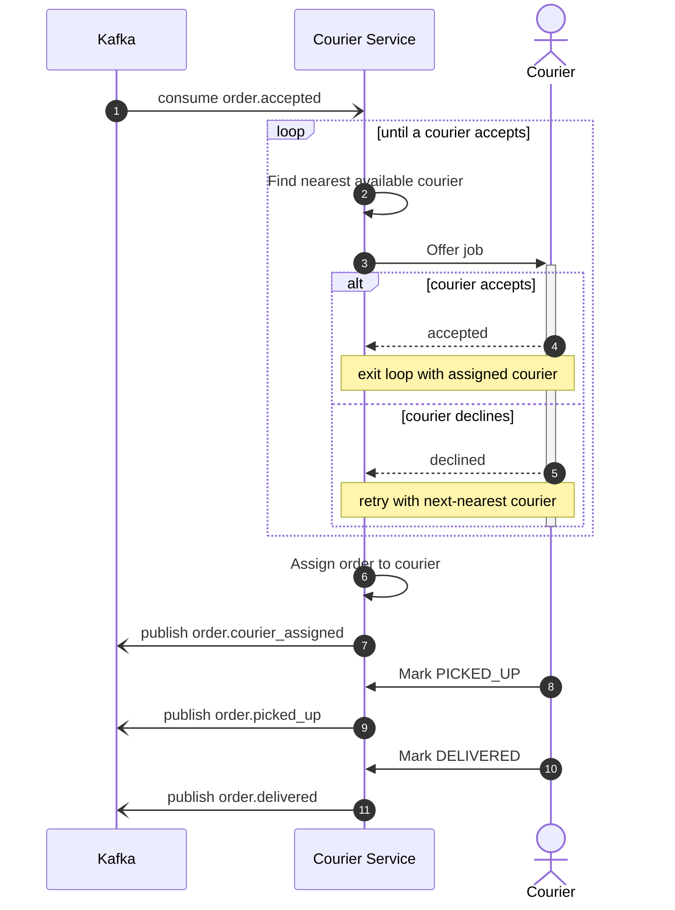
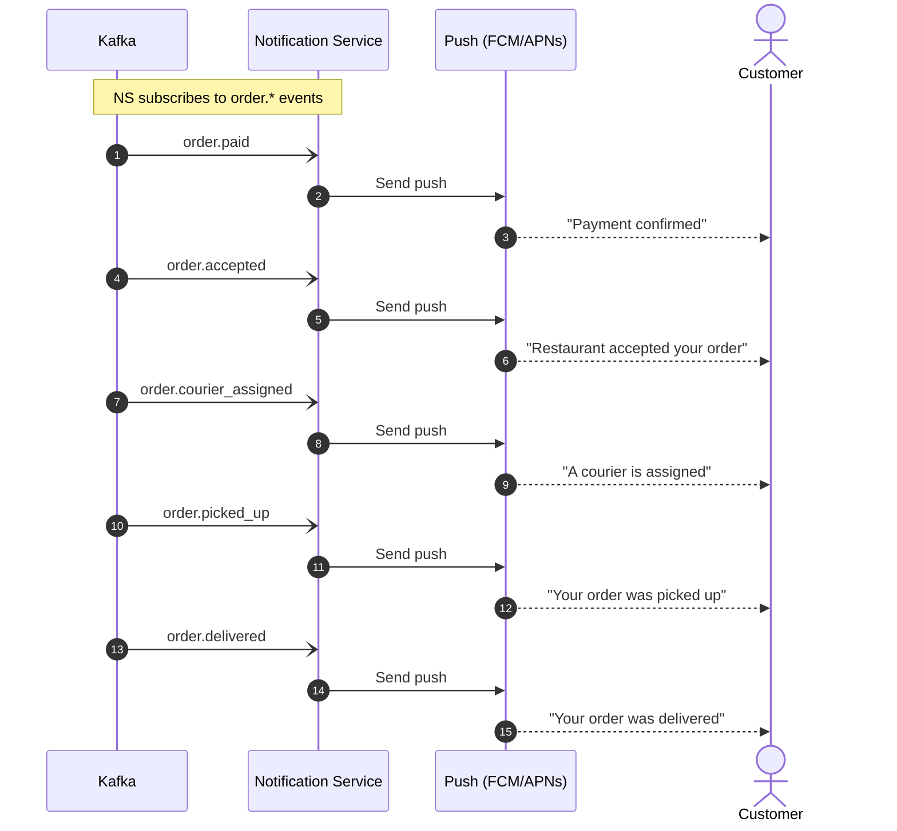

Here is the food delivery order lifecycle as a set of Mermaid sequence diagrams, ready to paste into the engineering wiki (GitHub renders these `mermaid` blocks natively). I split the flow into four diagrams because the whole lifecycle is well past what stays readable in one — participant ids and labels are identical across all four, so they read as one set. The first three cover the happy path plus the failure branches you described; the fourth is the cross-cutting Notification Service that consumes every `order.*` event.

## 1. Order placement and payment

The customer places the order; it flows through the gateway to the Order Service, which persists it as `PENDING` and authorizes the card via the Payment Service and Stripe. Approved orders become `PAID` and emit `order.paid` to Kafka; declined cards mark the order `FAILED` and the app shows the error (steps 16-22).

## 2. Restaurant acceptance

Continues from step 12 of diagram 1 (`order.paid` on Kafka). The Restaurant Service consumes it, pushes the order to the restaurant tablet, and waits for accept/reject. On reject it refunds via the Payment Service, marks the order `CANCELLED`, and notifies the customer; on accept it publishes `order.accepted`.

## 3. Courier assignment and delivery

Continues from the `order.accepted` event in diagram 2. The Courier Service consumes it, finds the nearest available courier, and offers the job — a courier may decline, so it loops to the next-nearest until one accepts. The assigned courier picks up and delivers, and the Courier Service publishes a status event at each transition.

## 4. Customer notifications (cross-cutting)

The Notification Service subscribes to every `order.*` event published across diagrams 1-3 and sends the customer a push notification at each stage. This runs in parallel with the flows above rather than in sequence.

---

**Validation:** I could not validate these here. The Mermaid MCP server returned a transport error on every call, and mermaid-cli is installed but cannot render in this environment (no Chrome for its headless browser). GitHub and GitLab render `mermaid` blocks natively, so they will display in the wiki as-is; to preview or tweak them yourself, paste any block into <https://mermaid.live>.

**Two mechanisms I chose where you stated the fact but not the plumbing**, flagged so you can correct them:
- The push-notification transport in diagram 4 is shown as a generic `Push (FCM/APNs)` participant — you said "push notification" but not the provider.
- The Kafka event names for the later stages (`order.cancelled`, `order.courier_assigned`, `order.picked_up`, `order.delivered`) follow the `order.*` convention you established for `order.paid` and `order.accepted`; rename them if your actual topics differ.

Everything else — endpoints, statuses (`PENDING`/`PAID`/`FAILED`/`CANCELLED`/`PICKED_UP`/`DELIVERED`), the decline/reject/refund branches, and the courier-decline retry loop — comes straight from your description.
