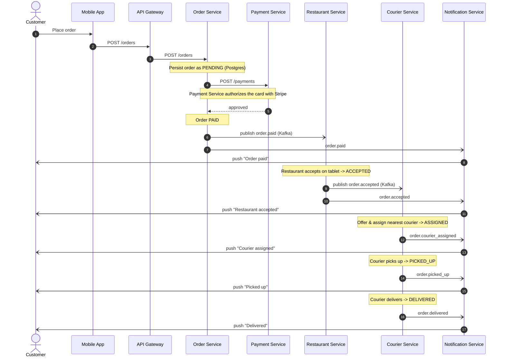
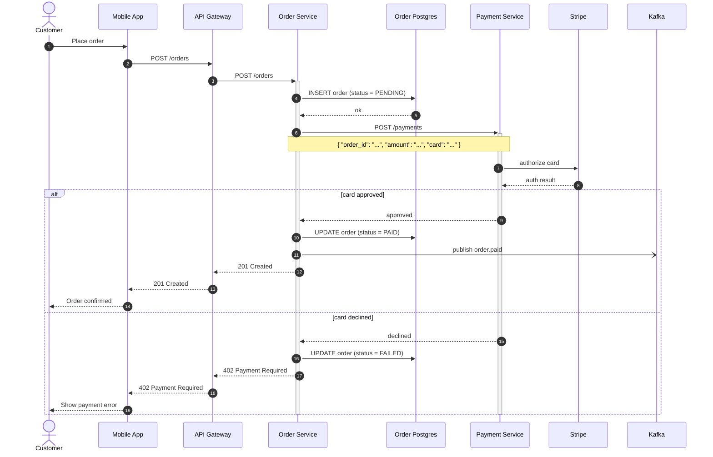
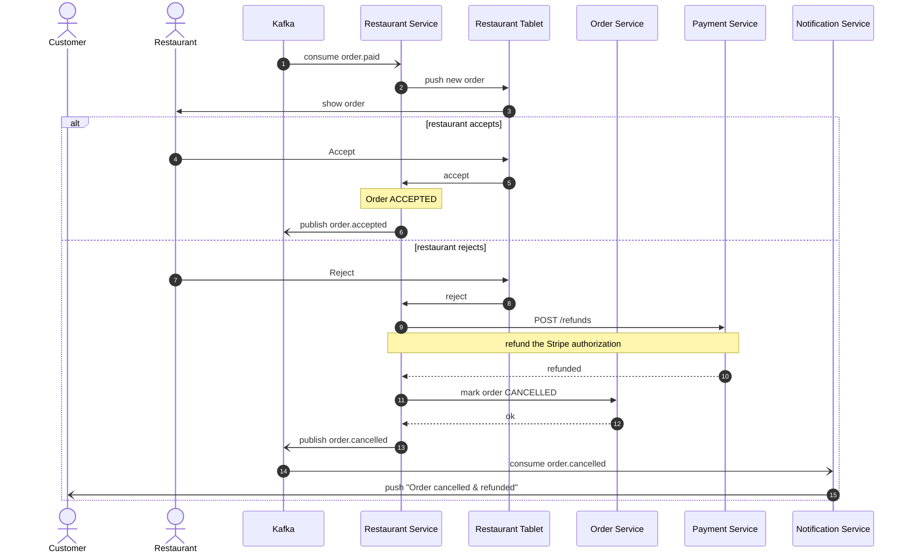
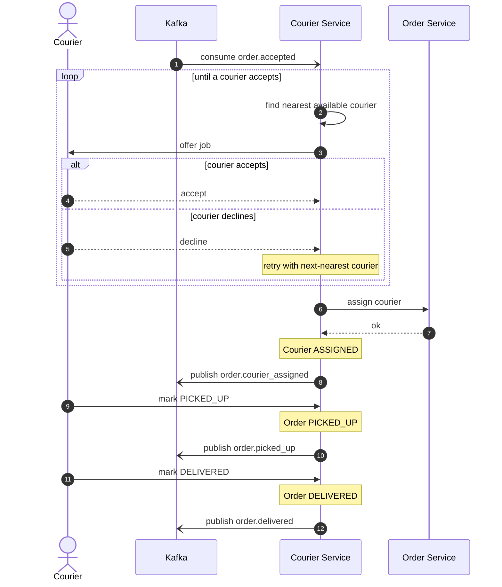
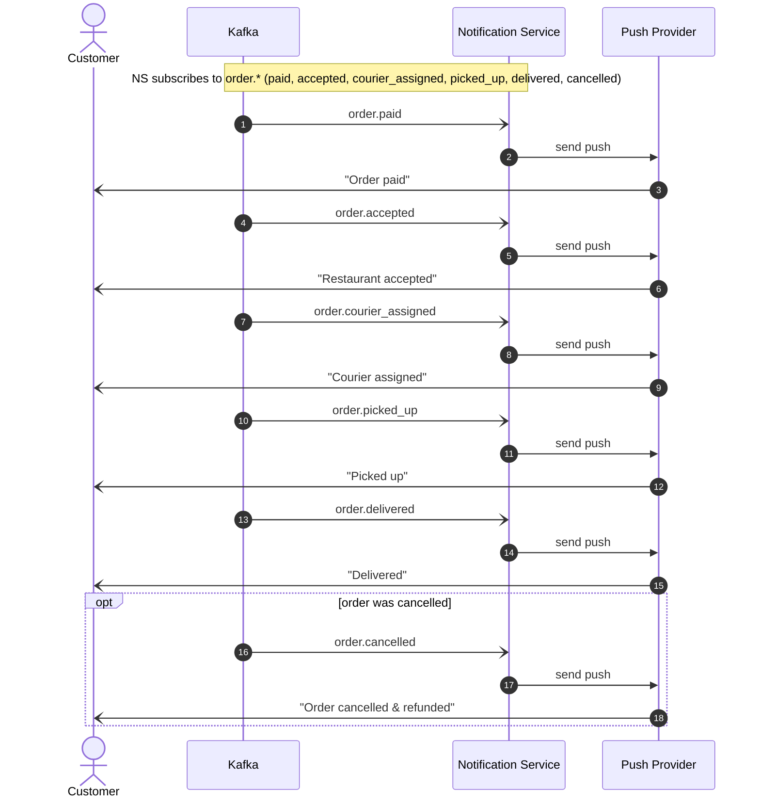

Here is the food delivery order lifecycle documented as Mermaid sequence diagrams. The flow is large (8 services plus the customer, ~30+ interactions, multiple failure branches), so I split it into one overview plus four phase diagrams rather than one wall of arrows. Participant ids and labels are identical across every diagram, so they read as one set. All blocks paste directly into a GitHub wiki — GitHub renders ```mermaid``` natively.

> Validation note: the connected Mermaid MCP server returned transport-level errors on every attempt, and mermaid-cli is installed here (v11.15.0) but cannot render (no Chrome — "Could not find Chrome", an environment problem, not a syntax one). So these blocks were **not rendered/validated in this environment**. They use only safe-core Mermaid syntax that GitHub and GitLab support; to preview or edit, paste any block into <https://mermaid.live>.

## 1. Overview — end-to-end happy path

A zoomed-out view of the whole lifecycle. Each phase below drills into one segment of this diagram and adds its failure branch. Kafka topics are shown as async (open-arrow) messages; the consuming service is named on the publish.



## 2. Phase 1 — order placement & payment (with the declined branch)

From the tap in the app through card authorization. The `alt` covers both Stripe outcomes: approved continues the saga; declined ends it as FAILED.



## 3. Phase 2 — restaurant accept / reject (with the refund + cancel branch)

Continues from step "publish order.paid" above. The Restaurant Service consumes `order.paid`, pushes the order to the tablet, and the restaurant either accepts (saga continues to the courier phase) or rejects (refund via the Payment Service, order CANCELLED, customer notified).



## 4. Phase 3 — courier assignment & delivery (with the courier-declines retry loop)

Continues from `order.accepted`. The Courier Service finds the nearest available courier and offers the job; a courier can decline, so it loops to the next-nearest until one accepts. After assignment the courier picks up and delivers, and the service publishes a status event at each transition.



## 5. Phase 4 — notifications (cross-cutting)

The Notification Service consumes every `order.*` event and sends one push to the customer per stage. This is the fan-in that the other diagrams reference; shown once here instead of repeating the push on every phase.



### Reading guide

- **Diagram 1** is the map; diagrams 2-5 are the territory. Order status moves PENDING -> PAID -> ACCEPTED -> ASSIGNED -> PICKED_UP -> DELIVERED on the happy path, with FAILED (declined payment) and CANCELLED (restaurant reject) as the two terminal failure branches you called out.
- **Failure branches**, all drawn: payment declined -> FAILED + error to the app (diagram 2); restaurant rejects -> refund + CANCELLED + notify (diagram 3); courier declines -> retry the next-nearest courier in a loop (diagram 4).
- **Plumbing I had to choose** (flagged so you can correct it): the customer-facing pushes go through a generic "Push Provider" because you didn't name one (APNs/FCM/etc.); the gateway returns `201`/`402` to the app on the synchronous order call; and topic names like `order.courier_assigned` / `order.cancelled` follow your `order.*` convention but were not given verbatim. Everything else — services, the POST /orders and POST /payments calls, Stripe authorization, the Kafka hand-offs, and the status transitions — comes straight from your description.
