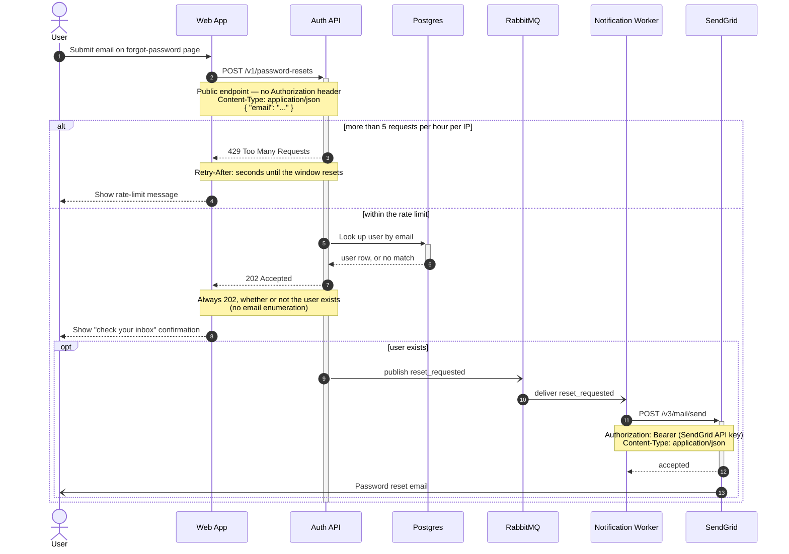

Here's the flow, written to `password-reset-flow.md` so you can paste it straight into the GitLab wiki page (GitLab renders ` ```mermaid ` blocks natively).



Reading it by step: the user submits their email (1) and the web app posts it to the public, unauthenticated `POST /v1/password-resets` (2). The rate limiter decides the branch — over 5 requests/hour from one IP the Auth API answers `429` with `Retry-After` (3–5); otherwise it looks the address up in Postgres (6–7) and answers `202 Accepted` regardless of the result (8), so the response can't be used to enumerate emails (9–10). Only when the user really exists does the `opt` branch run: `reset_requested` goes onto RabbitMQ fire-and-forget (11), the Notification worker consumes it (12) and calls SendGrid's `POST /v3/mail/send` with the Bearer key (13–15), which delivers the reset email (16).

Two things to check against reality:

- **Not validated here.** The diagram carries your internal endpoints, headers and system names, so I didn't send it to the hosted Mermaid render service, and there's no local `mermaid-cli` on this machine (I didn't install one). It uses only safe-core syntax that GitLab's bundled Mermaid supports, so the wiki preview is the quickest check — or paste it into <https://mermaid.live> if you're comfortable with the content leaving your machine. Say the word and I'll run the hosted validator instead.
- **Steps 12 and 16 are mechanism I filled in**, since you described the effect rather than the plumbing: the worker consuming from the queue, and SendGrid actually delivering the mail to the user's inbox. Adjust the labels if your queue topology (exchange/routing key) is worth naming.

Failure paths I deliberately left out, because you didn't say what happens: a Postgres lookup timeout, a failed publish to RabbitMQ, a non-2xx from SendGrid, and queue retry/dead-lettering. Tell me how any of those behave and I'll add them — either as branches here or as a small companion diagram so this one stays readable.
