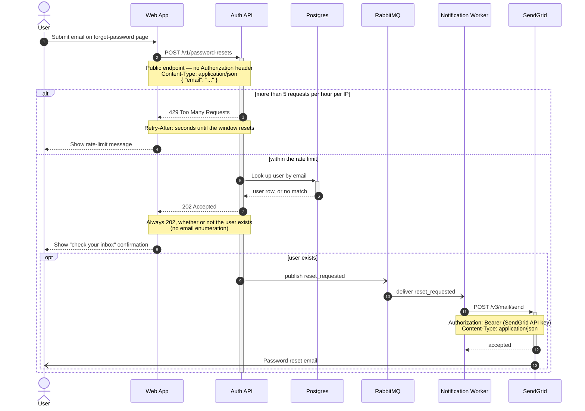

# Password reset flow

How a password reset request travels from the forgot-password page to the reset email.
The `alt` block covers the two outcomes of the rate limiter; the `opt` block is the part
that only happens when the email actually belongs to a user — the response the caller
sees is the same either way.

