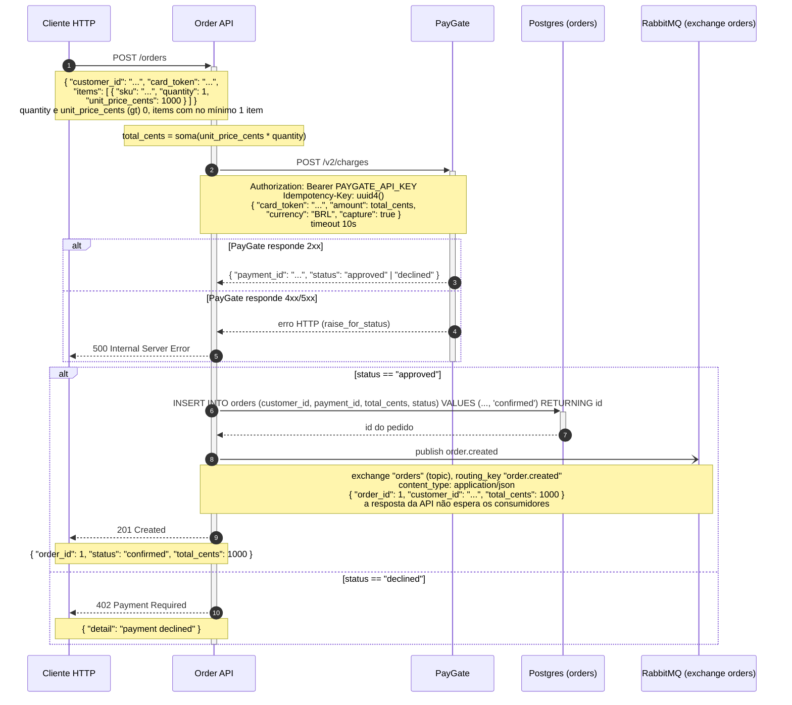

Li os quatro arquivos (`main.py`, `payments.py`, `events.py`, `db.py`) e montei o diagrama só com o que está no código. Salvei a seção pronta para colar no README em `post-orders-sequence.md`; segue o conteúdo:

## Fluxo de criação de pedido (`POST /orders`)



**Como ler:** o cliente envia o pedido (1); a API soma o total dos itens e cobra o cartão
no PayGate (3) com uma `Idempotency-Key` por requisição e timeout de 10s. Se o PayGate
devolver 4xx/5xx, o erro sobe e a API responde 500 (6). Com a cobrança aprovada, o
pedido é gravado no Postgres já com `status = 'confirmed'` (8), o evento `order.created`
é publicado no RabbitMQ sem que a resposta espere os consumidores (10) e o cliente
recebe 201 (11). Se o PayGate devolver `status: "declined"`, nada é gravado nem
publicado e a API responde 402 (13).

**Sobre validação:** o diagrama tem detalhe interno (endpoint do PayGate, header de
autorização, `Idempotency-Key`, campos do payload, colunas da tabela `orders`, exchange
e routing key do RabbitMQ), então evitei o servidor Mermaid MCP hospedado, que renderiza
remotamente. O `mermaid-cli` local não está instalado (e não instalei nada só para
validar), portanto **o código não foi validado aqui**. GitHub e GitLab renderizam blocos
` ```mermaid ` nativamente, e você pode colar o bloco em <https://mermaid.live> para
pré-visualizar e editar.

**Duas observações sobre o que ficou de fora / foi interpretado:**

- Erros de rede/timeout do lado do Postgres e do RabbitMQ não estão desenhados — o
  código não trata nenhum dos dois, e a exceção simplesmente sobe. Se quiser, dá para
  acrescentar um ramo mostrando que uma falha na publicação do evento derruba a resposta
  (hoje o `await publish_order_created(...)` acontece antes do `return`, ou seja: apesar
  de ser fire-and-forget para os consumidores, uma exceção ali ainda quebraria a
  requisição).
- A validação do Pydantic (422 quando `quantity`/`unit_price_cents` não são maiores que
  zero ou `items` vem vazio) também não está no diagrama, para não competir com o fluxo
  principal — falo se quiser que eu inclua.
