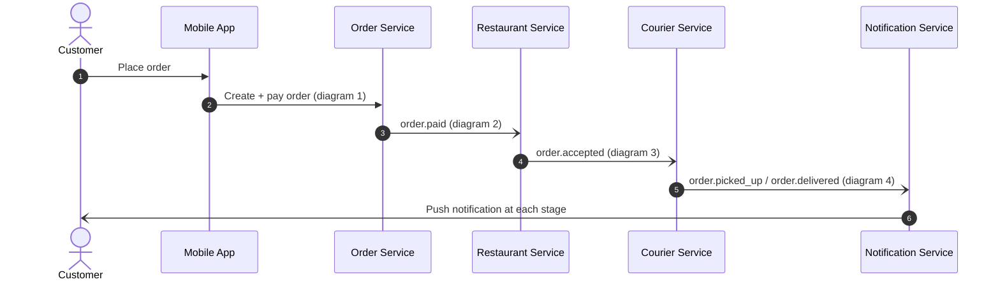
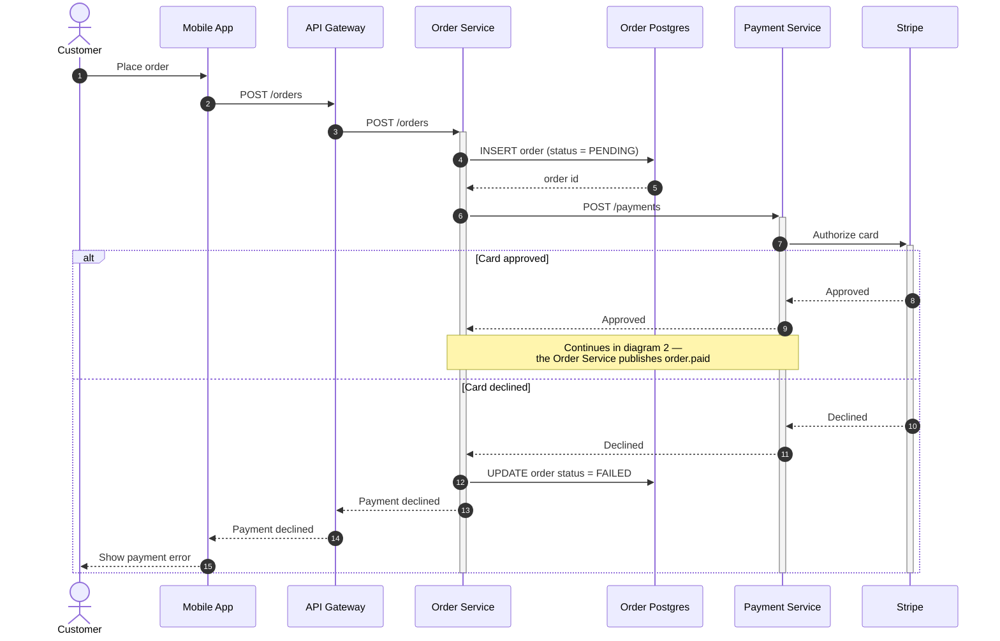
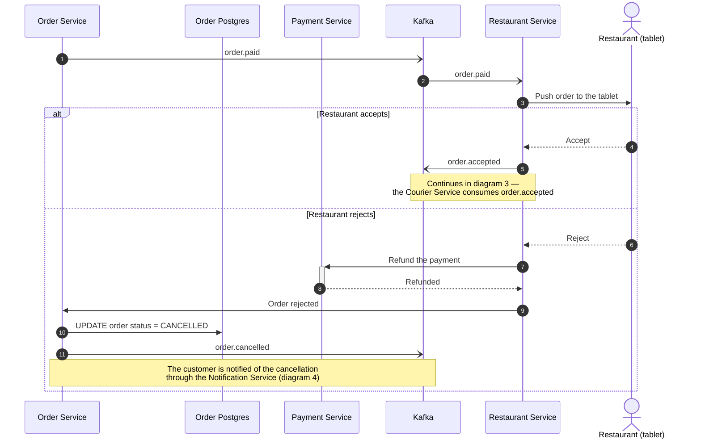
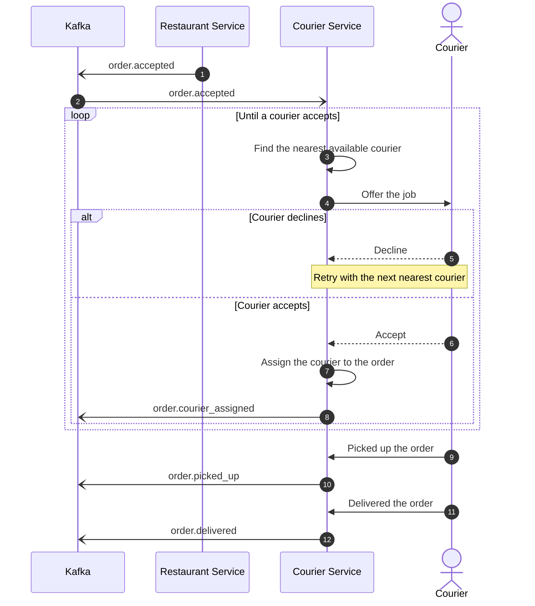
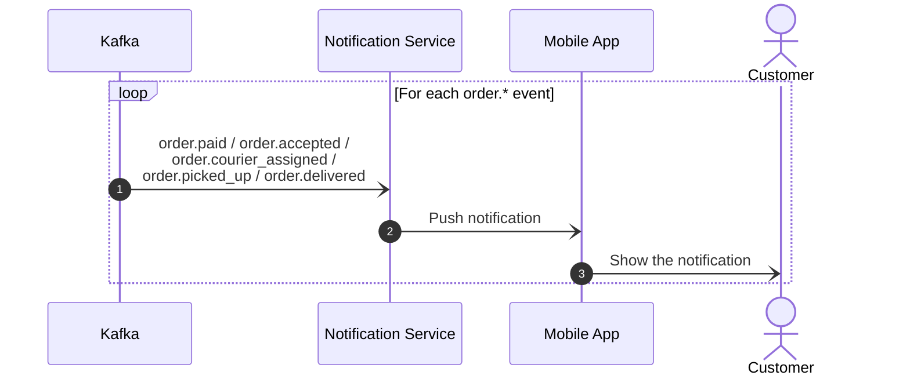

# Food delivery — order lifecycle

The full lifecycle is split into five diagrams: an overview plus one per phase, and a
last one for the notification fan-out. Participant ids and labels are the same across
all of them, so the same box means the same service everywhere.

## 0. Overview

<!-- preview/edit: https://l.mermaid.ai/Snxf1b -->

Coarse view of the whole saga — each numbered hop is expanded in the diagrams below.

## 1. Placement and payment

<!-- preview/edit: https://l.mermaid.ai/PofgdN -->

From the tap in the app to an authorized (or declined) card. Ends either in `FAILED`
(declined) or in the `order.paid` event that starts diagram 2.

## 2. Restaurant acceptance

<!-- preview/edit: https://l.mermaid.ai/pavq4I -->

Continues from the approved branch of diagram 1. The restaurant either accepts (which
starts diagram 3) or rejects, which refunds and cancels the order.

## 3. Courier assignment and delivery

<!-- preview/edit: https://l.mermaid.ai/IrGSak -->

Continues from `order.accepted` in diagram 2. The offer loop repeats with the next
nearest courier on every decline.

## 4. Notification fan-out

<!-- preview/edit: https://l.mermaid.ai/DSjTYE -->

The Notification Service consumes every `order.*` event and pushes one notification per
stage. Same shape for each event, so it is drawn once as a loop.

