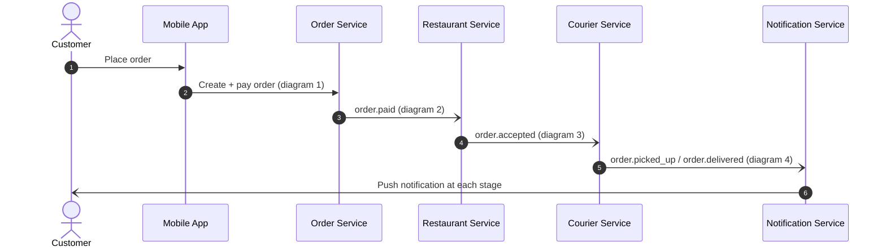
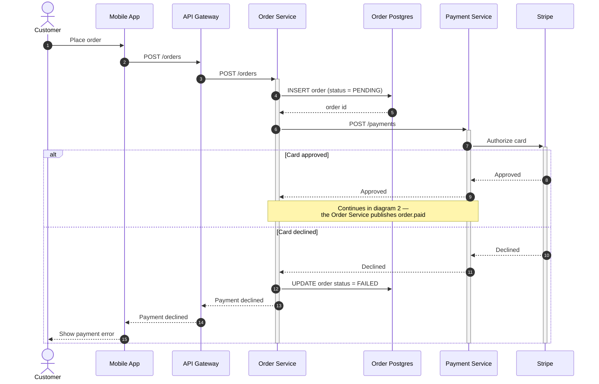
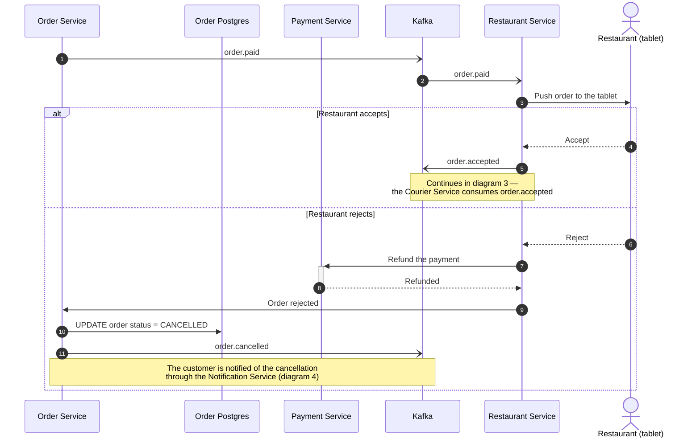
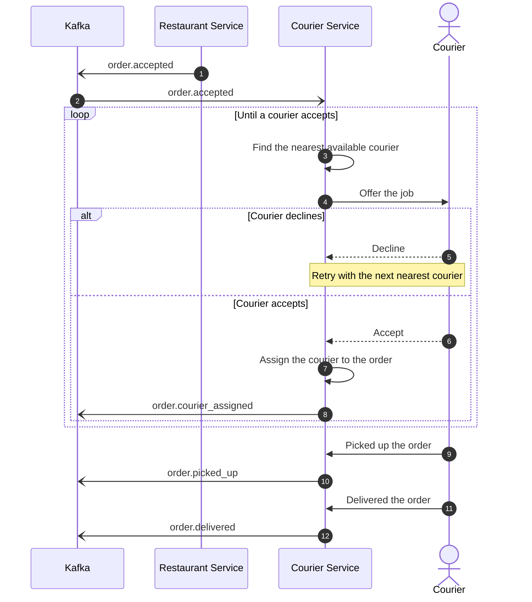
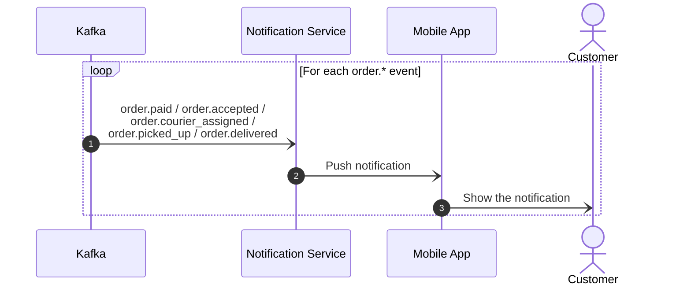

I wrote the whole lifecycle to `docs/order-lifecycle.md` as **five diagrams** instead of one — the full saga is ~40 messages and 13 participants, which renders as an unreadable wall. The split is by phase, with the same participant ids/labels everywhere and explicit "continues in diagram N" notes at the seams. All five are validated (rendered by the Mermaid MCP server) and use only safe-core syntax, so GitHub renders them as-is.

## 0. Overview — <https://l.mermaid.ai/Snxf1b>

Coarse view of the whole saga; each hop is expanded below.

## 1. Placement and payment — <https://l.mermaid.ai/PofgdN>

Steps 1-7 go from the tap in the app to the Stripe authorization. Step 8-9 approved continues into diagram 2; steps 10-15 are the declined branch (`FAILED` + error in the app).

## 2. Restaurant acceptance — <https://l.mermaid.ai/pavq4I>

Steps 1-3 deliver `order.paid` to the tablet. Accept (4-5) emits `order.accepted` and continues into diagram 3; reject (6-11) refunds through the Payment Service, sets `CANCELLED` and emits `order.cancelled`.

## 3. Courier assignment and delivery — <https://l.mermaid.ai/IrGSak>

Steps 3-8 are the offer loop: nearest courier, offer, decline retries with the next one, accept assigns and emits `order.courier_assigned`. Steps 9-12 are pickup and delivery with their status events.

## 4. Notification fan-out — <https://l.mermaid.ai/DSjTYE>

Drawn once as a loop because the shape is identical for all five stages.

## Two things I filled in — check them

- **Push delivery mechanism.** You said the customer gets a push notification at each stage but not how it reaches the device, so diagram 4 shows Notification Service → Mobile App → Customer. If there is an APNs/FCM (or similar) hop in between, tell me and I will add it.
- **Cancellation notice.** You said "order CANCELLED, customer notified" without naming the event, so I drew the Order Service publishing `order.cancelled`, consumed by the Notification Service like the other `order.*` events. If the cancellation notice goes out some other way, that arrow should change.

## Deliberately not drawn (you did not describe them)

Payment/Stripe timeouts, Kafka consumer retries or DLQs, an offer timeout when a courier neither accepts nor declines, and the exhaustion case where every courier declines. Say what should happen in any of those and I will add the branch — I did not want to invent failure handling.

Notes are conceptual: you gave endpoints (`POST /orders`, `POST /payments`) and status names, but no headers or payload fields, so I did not put any in.
