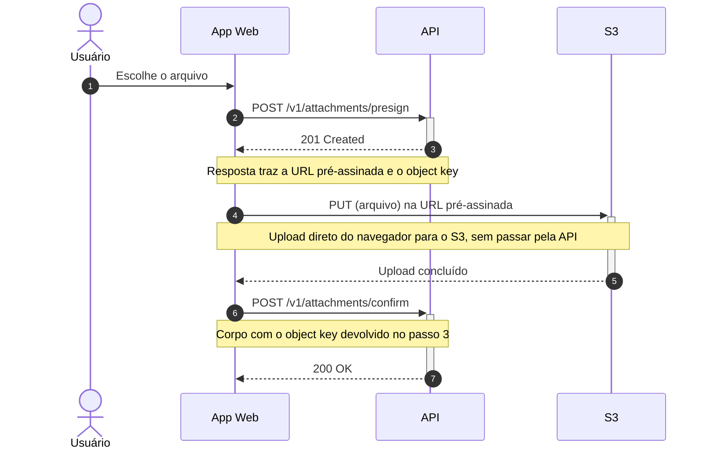

Segue o diagrama do fluxo de upload de anexo:



**Não consegui validar o código aqui**: não há servidor MCP de Mermaid conectado nesta
sessão e o `mmdc` (mermaid-cli) não está instalado nesta máquina — confirmei com
`command -v mmdc`, sem resultado. Não instalei nada só para validar. O bloco
` ```mermaid ` renderiza nativamente no GitHub e no GitLab, e você pode colar o código em
<https://mermaid.live> para pré-visualizar e editar.

**Leitura do fluxo**: o usuário escolhe o arquivo (1), o app pede a URL pré-assinada à API
(2) e recebe 201 com a URL e o object key (3); o app envia o arquivo direto ao S3 (4) e,
com o upload concluído (6), confirma o anexo na API pelo object key (7), que responde 200
(8).

**O que ficou de fora, de propósito** — você não descreveu o comportamento de erro, e eu
não invento caminho de falha. Ficaram sem representação:

- presign recusado (por exemplo 4xx por autenticação, tipo de arquivo ou tamanho);
- PUT no S3 falhando ou expirando a URL pré-assinada — o app tenta de novo, pede novo
  presign, ou aborta?
- confirm chamado para um object key que não chegou ao S3, ou nunca chamado (anexo órfão) —
  existe alguma limpeza?

Duas coisas que preenchi por falta de detalhe, fáceis de ajustar: a resposta do S3 no passo
6 aparece como "Upload concluído" porque você não disse qual status ele devolve, e as notas
descrevem o conteúdo das mensagens sem nomes de campo JSON, que também não foram
estabelecidos. Se você me passar o payload real (ou o trecho de código), eu detalho as
notas — e, se quiser, incluo os caminhos de falha acima.
