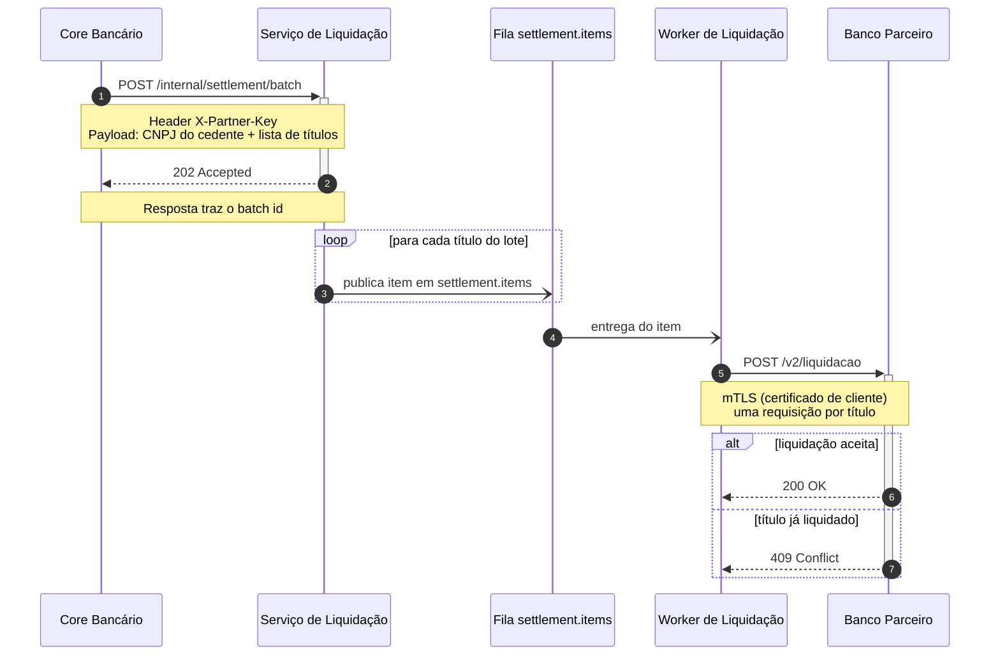

Como o fluxo é confidencial, **não usei o servidor MCP do Mermaid** que está conectado nesta sessão: ele é o hospedado (`mcp.mermaid.ai`) e renderiza remotamente — o diagrama (endpoint interno, header, mTLS, nome do parceiro) sairia desta máquina. Tentei o caminho local: o `mermaid-cli` (`mmdc`) não está instalado aqui e não instalo nada só para validar. Portanto **o código abaixo não foi validado**; ele usa apenas sintaxe do núcleo estável do Mermaid, que GitHub e GitLab renderizam nativamente em blocos ` ```mermaid ` — colar num Markdown privado do repositório é a forma de preview que não expõe o conteúdo. (O <https://mermaid.live> também envia o texto para fora, então evite para este diagrama.)

## Liquidação com o banco parceiro — caminho principal



**Leitura rápida:** o core bancário abre o lote (1) e recebe o `batch id` de imediato (3) — o processamento é assíncrono; o serviço de liquidação quebra o lote em itens na fila `settlement.items` (4), e cada item consumido pelo worker (5) vira uma chamada mTLS ao parceiro (6), que responde 200 na liquidação ou 409 quando o título já estava liquidado (7–8).

**O que desenhei sem você ter dito, e está sinalizado:** o consumo da fila pelo worker (passo 5) é o mecanismo óbvio, mas você não descreveu como ele acontece; e a nota do payload ficou conceitual ("CNPJ do cedente + lista de títulos") porque você não me passou os nomes reais dos campos.

**O que eu não inventei — e preciso de você para completar:**

1. O que o worker faz depois de cada resposta? O 200 e o 409 atualizam algum estado/status do título, ou geram callback/notificação de volta para o core bancário? Isso hoje some do diagrama após o passo 8.
2. Existe tratamento de falha real a documentar — timeout/erro de rede na chamada ao parceiro, 5xx, retry da fila, DLQ? Se existir, digo em qual bloco entra (`break`/`loop`); se preferir só o caminho feliz, deixo explícito que timeouts e 5xx do parceiro ficaram de fora.
3. As notas devem carregar os campos reais do payload e o formato do `batch id`, ou o diagrama vai para um documento que não pode expor nomes de campo internos?
4. Quer que eu grave isso num arquivo do repositório (ex.: `docs/liquidacao-parceiro.md`) ou basta o bloco aqui?
