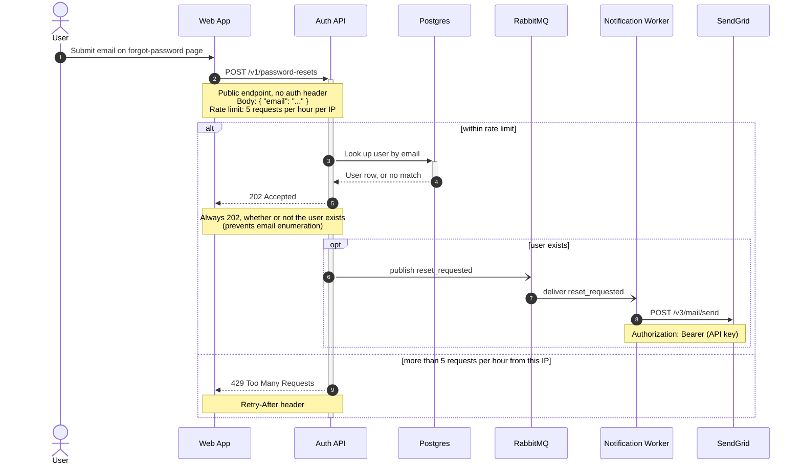

Here is the password reset flow. I wrote it to `password-reset-flow.md` in the workspace so you can paste the page straight into the GitLab wiki — the diagram itself is below.



**Reading it:** steps 1–2, the user submits their email and the web app posts it to the public, unauthenticated `POST /v1/password-resets`. Steps 3–5 are the within-limit path: the Auth API looks the address up in Postgres and answers `202 Accepted` either way, so the response can't be used to enumerate registered emails. Steps 6–8 run only when the user actually exists — `reset_requested` goes to RabbitMQ (async, open arrowheads), the Notification worker consumes it and calls SendGrid. Step 9 is the rate-limit case: past 5 requests/hour from an IP the API returns `429` with `Retry-After`.

**Validation:** I did **not** send this to the hosted Mermaid MCP server — it renders remotely and the diagram carries your endpoints, header names and payload fields — and mermaid-cli isn't installed here, so **the code was not validated on this machine**. GitLab renders ` ```mermaid ` blocks natively, so the wiki preview is your quickest check; <https://mermaid.live> also works if you're fine pasting it there. Say the word if remote validation is acceptable and I'll run it through the MCP server and give you a preview link.

Syntax is all safe-core Mermaid (no version-gated features), so any GitLab version that renders Mermaid at all will handle it.

A few things I deliberately left out because you didn't specify them — tell me and I'll add them:

- What the web app shows the user after the `202`, and after the `429`. The flow currently ends at the Auth API's response.
- SendGrid's response to `POST /v3/mail/send`, and what the worker does if that call fails (or if it retries the RabbitMQ message).
- Where the reset token/link is generated and stored — I didn't guess whether that's the Auth API before publishing or the worker while composing the email.
- I also left the request `Content-Type` out of the note: you said the body is JSON, but not which header the endpoint actually expects, and a guessed header is the kind of detail that misleads someone debugging a 415.
