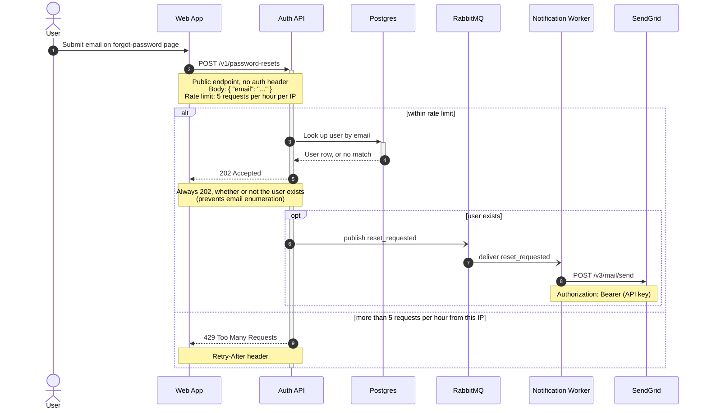

# Password reset flow

How a password reset is requested and delivered, from the forgot-password page to the
outgoing email. Covers the happy path, the always-202 anti-enumeration behaviour, and
the rate-limited case.

## Reading it

Steps 1–2: the user submits their email and the web app posts it to the public,
unauthenticated `POST /v1/password-resets`. Steps 3–5 (within the rate limit): the Auth
API looks the address up in Postgres and answers `202 Accepted` regardless of the
result, so the response cannot be used to enumerate registered emails. Steps 6–8 run
only when the user actually exists: the Auth API publishes `reset_requested` to
RabbitMQ, the Notification worker consumes it and sends the email through SendGrid.
Step 9 is the rate-limited case — the 6th request within an hour from the same IP gets
`429` with `Retry-After`.
