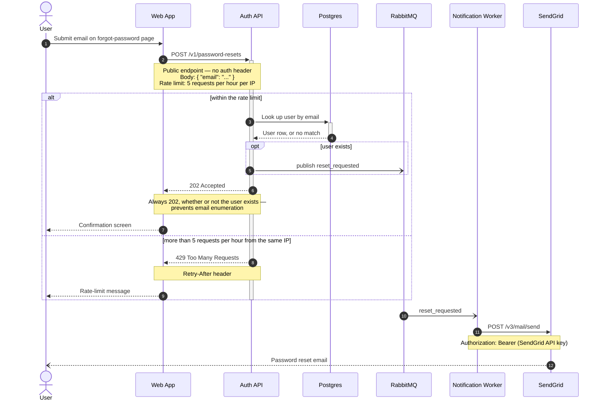

Here's the password reset flow as a Mermaid sequence diagram. I also saved it to
`password-reset-flow.md` in the workspace so you can drop it straight into the wiki page.

**Reading it:** the user submits their email (1) and the Web App posts it to the Auth API
(2). Under the rate limit, the Auth API looks the address up in Postgres (3–4) and, only
when a user actually exists, publishes `reset_requested` to RabbitMQ (5) — but it answers
202 either way (6), so the response can't be used to enumerate accounts. Over the limit,
the same call comes back 429 with `Retry-After` (9). Steps 11–13 are the asynchronous
half: the Notification Worker consumes the event and sends the mail through SendGrid,
which delivers it to the user.

**Two things I chose, so you can correct them:** you didn't say what the Web App shows the
user after the 202 or after a 429, so I drew a neutral "Confirmation screen" and
"Rate-limit message" — swap in your real copy. And the final arrow to the user is
SendGrid delivering the mail, which is the mechanism implied by "sends the email through
SendGrid".

**Not shown, deliberately:** failure paths you didn't describe — Postgres unreachable,
the RabbitMQ publish failing, the SendGrid call returning a non-2xx or the worker's retry
policy. Tell me what actually happens in any of those and I'll add the branches.

**Validation:** the diagram was **not machine-validated here**. The flow carries internal
detail — your broker topology, the event name, the SendGrid bearer header — so I didn't
send it to the hosted Mermaid validator, which renders remotely, and for the same reason
I'd skip pasting it into mermaid.live. The best preview is the one you already own: put
the file (or the fenced block) on a GitLab wiki page or a branch and let GitLab's native
Mermaid rendering show it. If you consider the exposure acceptable, say the word and I'll
run it through the hosted validator for a rendered preview link.

Syntax-wise it stays inside Mermaid's safe core (participants, `alt`/`opt`, activations,
`-)` async arrows, notes, `autonumber`), so any GitLab version that renders Mermaid at
all will render this.
