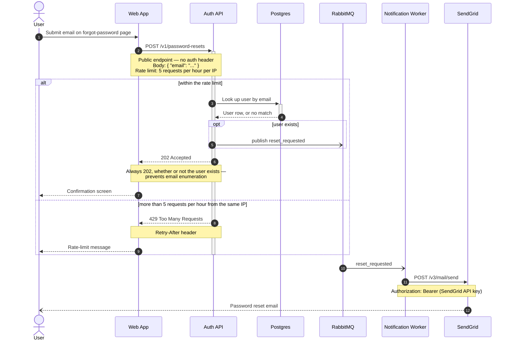

# Password reset flow

How a password reset is requested and delivered, from the forgot-password page to the
email in the user's inbox. Covers the rate-limited case.

```mermaid
sequenceDiagram
    autonumber
    actor U as User
    participant W as Web App
    participant A as Auth API
    participant DB as Postgres
    participant MQ as RabbitMQ
    participant N as Notification Worker
    participant SG as SendGrid

    U->>W: Submit email on forgot-password page
    W->>+A: POST /v1/password-resets
    Note over W,A: Public endpoint — no auth header<br/>Body: { "email": "..." }<br/>Rate limit: 5 requests per hour per IP

    alt within the rate limit
        A->>+DB: Look up user by email
        DB-->>-A: User row, or no match
        opt user exists
            A-)MQ: publish reset_requested
        end
        A-->>W: 202 Accepted
        Note over W,A: Always 202, whether or not the user exists —<br/>prevents email enumeration
        W-->>U: Confirmation screen
    else more than 5 requests per hour from the same IP
        A-->>W: 429 Too Many Requests
        Note over W,A: Retry-After header
        W-->>U: Rate-limit message
    end
    deactivate A

    %% Asynchronous delivery — only reached when reset_requested was published
    MQ-)N: reset_requested
    N->>SG: POST /v3/mail/send
    Note over N,SG: Authorization: Bearer (SendGrid API key)
    SG--)U: Password reset email
```
