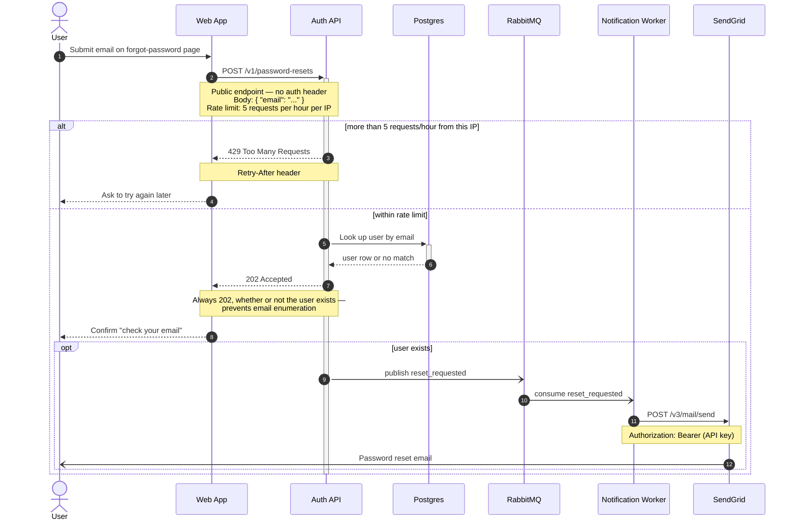

Here's the password reset flow, ready to paste into the GitLab wiki page (GitLab renders `mermaid` blocks natively):

Reading it by step: the user submits their email (1) and the web app posts it to the public, rate-limited endpoint (2). If that IP is over 5 requests in the hour, the API answers 429 with `Retry-After` (3–4). Otherwise the API looks the address up in Postgres (5–6) and returns 202 either way (7–8), so a caller can't tell an existing account from a missing one. Only when the user actually exists does the API publish `reset_requested` to RabbitMQ (9), the Notification worker consumes it (10) and hands the mail to SendGrid (11), which delivers it to the user (12).

Two things I deliberately did not put in the diagram, since you didn't specify them and I didn't want to invent documentation:

- **What SendGrid returns** and how the worker reacts to a failed send (retry? dead-letter?). Step 11 is drawn as a one-way call for that reason — tell me the behaviour and I'll add the reply and any retry `loop`.
- **The rest of the flow** — the emailed link, token expiry, and the actual password change endpoint. Happy to draw that as a second diagram in the same page if the wiki article should cover the whole journey.

On validation: I did **not** validate this one through the hosted Mermaid server. It carries your internal endpoints, the `Authorization` header, your queue topology and your email provider, and that server renders remotely — so I kept the text on this machine. `mermaid-cli` isn't installed here (and I didn't install anything), so the code block is unvalidated. The quickest private check is GitLab itself: drop it into the wiki page preview, which is the renderer that has to agree with it anyway. If you'd rather have the round-trip preview and consider the exposure fine, say so and I'll run it through the hosted validator — it's your content and your call.

Everything used here is safe-core Mermaid syntax, so any GitLab version will render it.
