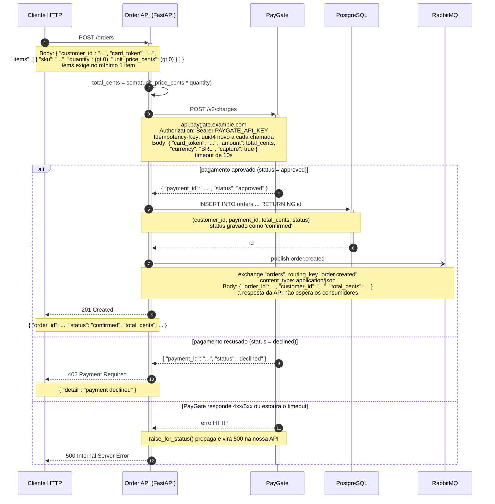

Li os quatro arquivos (`main.py`, `payments.py`, `db.py`, `events.py`) e montei o diagrama só com o que está no código. Cole o bloco abaixo direto no README — GitHub e GitLab renderizam ` ```mermaid ` nativamente.



Como ler: o cliente manda o `POST /orders` (1), a API calcula o total a partir dos itens (2) e cobra o cartão no PayGate (3). Aprovado, ela grava o pedido no Postgres com status `confirmed` (5), publica `order.created` no exchange `orders` do RabbitMQ sem esperar consumidor (7) e devolve `201` (9). Recusado, para no `402` (12). Se o PayGate falhar com 4xx/5xx ou estourar os 10s de timeout, o `raise_for_status()` sobe e o cliente recebe `500` (15).

Sobre a validação: o diagrama carrega detalhe interno de vocês (URL e chave do parceiro de pagamento, nomes de campos, tabela, exchange), então **não** mandei o código para o servidor Mermaid hospedado que está conectado aqui — ele renderiza remotamente. O `mmdc` local não está instalado e eu não instalei nada, então **o código não foi validado nesta máquina**. Pelo mesmo motivo não sugiro colar no mermaid.live: é o mesmo tipo de renderizador remoto. A checagem sem exposição é abrir o próprio README no preview do GitHub/GitLab do repositório — que já hospeda esse código. Se para vocês essa exposição for aceitável, é só falar que eu valido pelo servidor hospedado e devolvo o link de preview.

Duas coisas que deixei de fora de propósito, porque o código não as estabelece explicitamente: o `422` de validação do Pydantic (corpo inválido, `quantity`/`unit_price_cents` menores ou iguais a zero, lista de itens vazia) e qualquer falha na gravação no Postgres ou na publicação no RabbitMQ — hoje elas simplesmente sobem como erro. Se quiser, incluo esses caminhos, mas aí preciso que vocês me digam o que de fato acontece.
