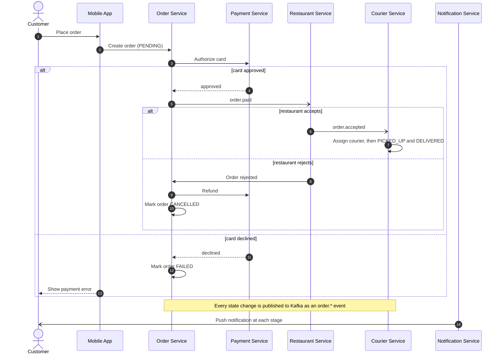
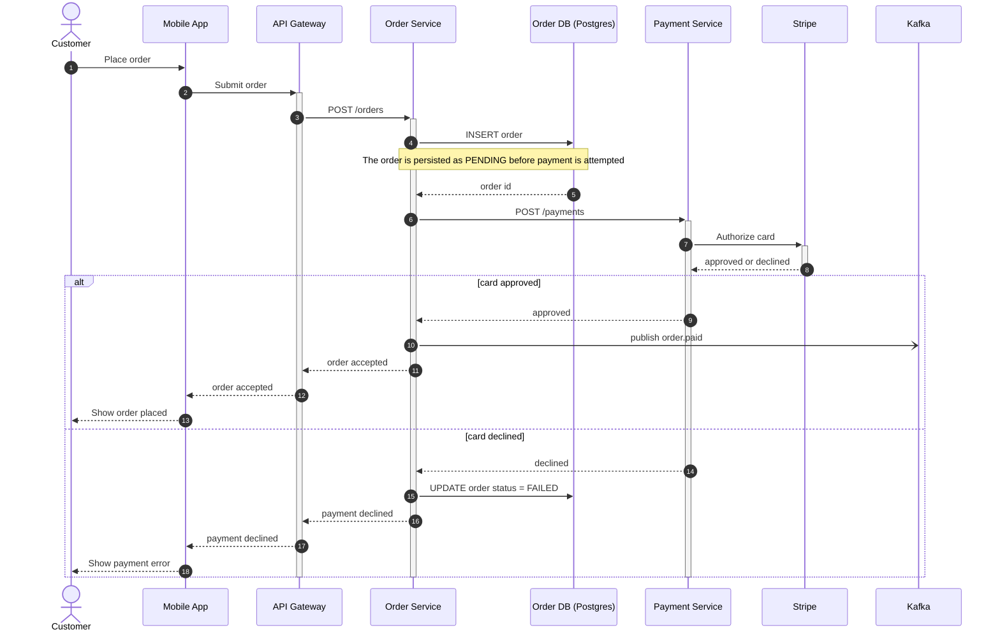
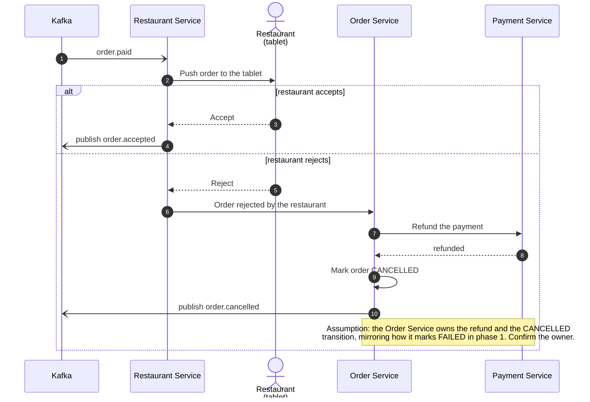
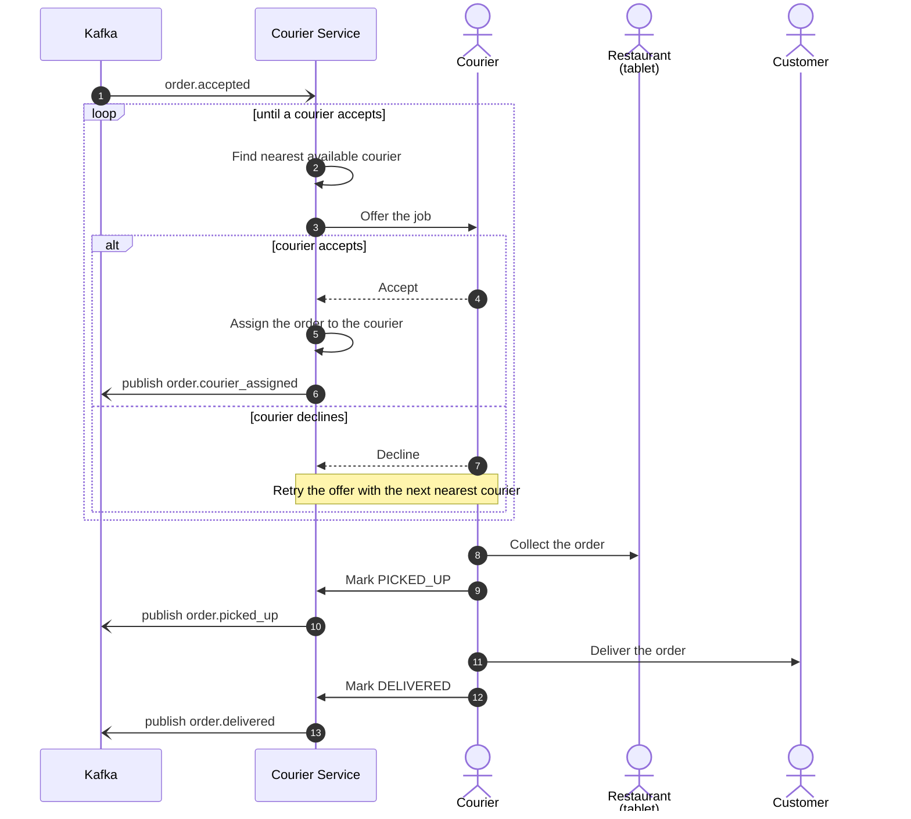
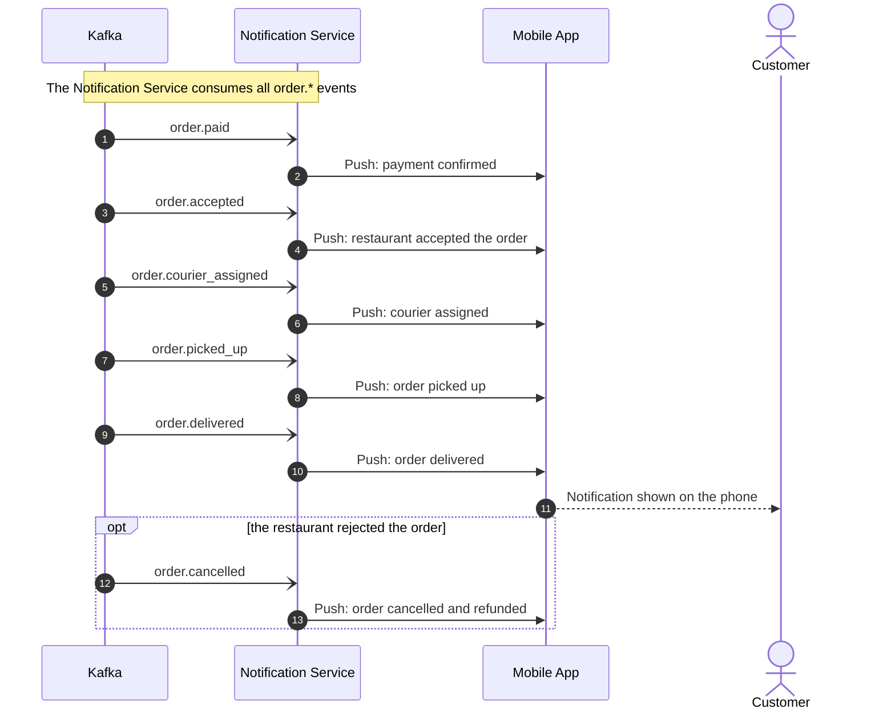

# Food delivery — order lifecycle

How an order moves from "Place order" in the mobile app to "Delivered", including the
payment-declined, restaurant-rejected and courier-declined branches.

The flow is split into one overview plus four phase diagrams — a single diagram would run
past 25 messages and 12 participants and stop being readable. Participant ids and labels
are identical across the whole set, and each phase says where it continues from.

---

## 1. Overview

Coarse view of the whole lifecycle. Each branch is drawn in detail in the diagrams below.

---

## 2. Phase 1 — placing the order and paying

From the tap in the app to `order.paid` on Kafka, with the declined branch.

---

## 3. Phase 2 — the restaurant accepts or rejects

Continues from step 10 of phase 1 (`order.paid` published).

---

## 4. Phase 3 — courier assignment and delivery

Continues from step 5 of phase 2 (`order.accepted` published). The offer loop is the
retry the courier decline triggers.

---

## 5. Notifications (cross-cutting)

The Notification Service subscribes to every `order.*` event and pushes to the customer at
each stage. It runs alongside phases 1–3 rather than after them.

---

## Open points

These were drawn because you established the fact, but the mechanism was not stated —
worth confirming before this goes on the wiki:

- **Refund ownership (phase 2).** You said a rejection means "refund via the Payment
  Service, order CANCELLED, customer notified", not which service drives it. Drawn as the
  Order Service, consistent with it marking FAILED in phase 1.
- **Event names for the courier stages.** `order.paid` and `order.accepted` are yours;
  `order.courier_assigned`, `order.picked_up`, `order.delivered` and `order.cancelled` are
  placeholders that match the stages you listed. Replace with the real topic/event names.
- **Push delivery path.** "Push notification to the customer" is drawn as the Notification
  Service pushing to the mobile app; the actual transport (FCM/APNs or otherwise) is not
  shown because it was not stated.
- **Endpoints beyond `POST /orders` and `POST /payments`** are unnamed on purpose — no
  headers, payload fields or status codes were invented for the notes.
