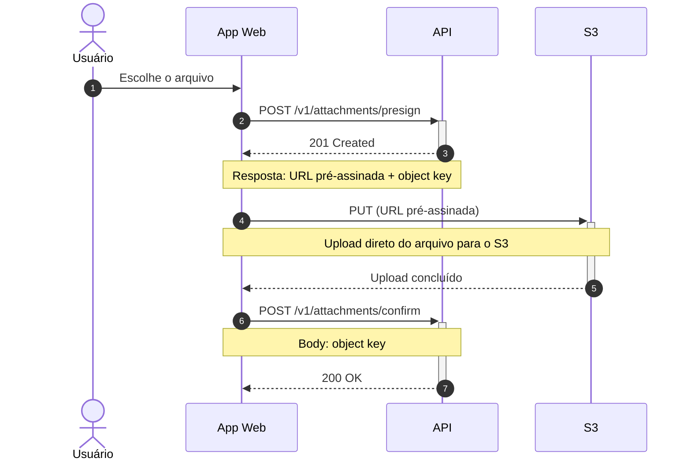

Aqui está o fluxo de upload de anexo como diagrama de sequência:



**Leitura rápida:** o usuário escolhe o arquivo (1), o app pede à API uma URL
pré-assinada (2) e recebe de volta a URL e o object key (3); com isso o app envia o
arquivo direto para o S3 (4), sem passar pela API; concluído o upload (6), o app
confirma para a API usando o object key (7) e recebe 200 (8).

**Não foi validado aqui:** esta máquina não tem mermaid-cli e não há servidor MCP de
Mermaid conectado nesta sessão, então não consegui renderizar nem checar a sintaxe.
O bloco ` ```mermaid ` é renderizado nativamente pelo GitHub e pelo GitLab, então
colar num `.md` do repositório já serve de preview; se preferir um preview interativo,
<https://mermaid.live> aceita o código colado — só lembrando que é um renderizador
remoto e o diagrama cita seus endpoints internos, então essa escolha é sua.

**O que ficou de fora, de propósito:** desenhei só o caminho feliz. Você não me disse o
que acontece quando o presign é recusado (arquivo grande demais, tipo não permitido), o
que acontece se o PUT no S3 falhar ou a URL expirar, e nem se o confirm pode voltar erro
(object key inexistente, upload não encontrado no bucket). Também não coloquei headers
nem campos de payload que você não mencionou — a única informação nas notas é a que você
descreveu. Se quiser, me conte como cada um desses passos falha e eu acrescento os ramos
`alt`/`break` correspondentes.
