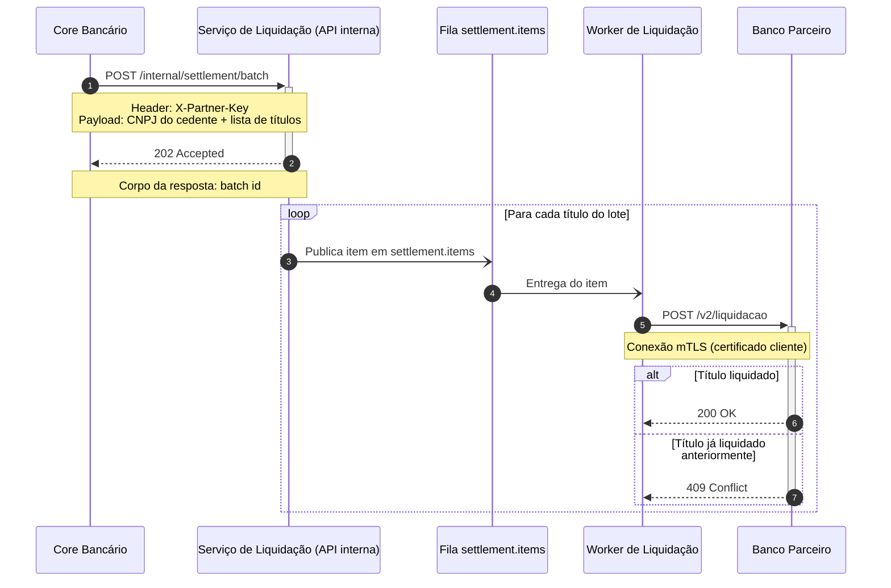

Antes do diagrama, um aviso sobre validação: como o fluxo é confidencial e o diagrama carrega detalhes internos (endpoint interno, nome do header, CNPJ do cedente, nome da fila, endpoint do parceiro), **não enviei o código para o servidor MCP do Mermaid** — ele renderiza remotamente, ou seja, o texto sairia da sua máquina. Detalhe abaixo sobre como pré-visualizar sem vazar.

## Liquidação — integração com o banco parceiro



### Como ler

O core bancário abre o fluxo chamando o endpoint interno (1) e recebe imediatamente um `202` com o batch id (3) — o processamento é assíncrono a partir daí. O serviço então publica um item por título na fila `settlement.items` (5), e o worker consome cada item (6) e chama o endpoint do parceiro sobre mTLS (7), que responde `200` quando a liquidação ocorre ou `409` quando aquele título já tinha sido liquidado (9/10).

### Validação e pré-visualização

O código **não foi validado aqui**. O `mermaid-cli` não está instalado nesta máquina, e o servidor MCP conectado é hospedado — mandar o diagrama para lá significaria transmitir o conteúdo confidencial para fora. Pelo mesmo motivo **não recomendo colar em mermaid.live**: é o mesmo tipo de renderizador remoto, então usá-lo desfaria a razão de eu ter pulado o MCP.

Para pré-visualizar sem exposição nova: cole o bloco em um arquivo Markdown do próprio repositório e abra no GitHub/GitLab de vocês — os dois renderizam blocos ` ```mermaid ` nativamente, e a plataforma já hospeda o código que este diagrama descreve. Se vocês avaliarem que a exposição é aceitável, é decisão de vocês — me avise e eu valido pelo MCP hospedado, ou instalem o `mermaid-cli` localmente para validar sem sair da máquina.

### Pontos que deixei de fora de propósito

Só desenhei o que você descreveu; não inventei tratamento de erro. Ficaram sem representação, e valem uma segunda versão do diagrama se você quiser:

- O que o worker faz depois do `200` e depois do `409` — marca o item como liquidado, ignora, registra? E o core bancário chega a saber o resultado de cada título, ou o `202` encerra a conversa?
- Falhas de infraestrutura: timeout ou 5xx do parceiro, falha de handshake mTLS, retry/DLQ na fila `settlement.items`.
- Rejeição na entrada: o que acontece quando o `X-Partner-Key` é inválido ou o payload não passa na validação.
