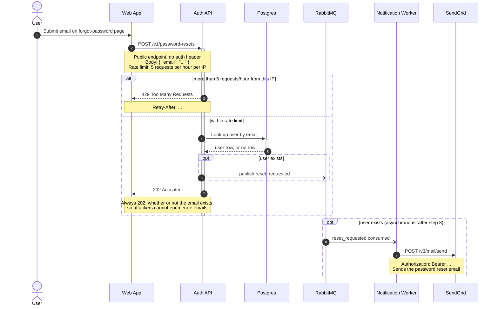

Here is the password reset flow as a Mermaid sequence diagram. Paste the block as-is into the GitLab wiki page; it uses only core Mermaid syntax, so GitLab's bundled renderer handles it.

Validated with the mermaid-cli Docker image (`minlag/mermaid-cli`), which rendered it without errors.

Walking through it: steps 1-2 are the user submitting the form and the web app calling the public, rate-limited endpoint. Steps 3 is the rate-limit branch (429 with `Retry-After`). Otherwise steps 4-5 look the user up in Postgres, step 6 publishes `reset_requested` to RabbitMQ only when the user exists, and step 7 returns 202 regardless of the lookup result. Steps 8-9 are the asynchronous tail: the Notification worker consumes the event and calls SendGrid with the bearer token. That tail is drawn as a second `opt` block after the 202 so the diagram doesn't imply the email is sent before the API responds.

Two things I deliberately left out because you didn't specify them, and I didn't want to guess:

- What the web app shows the user after the 202 and after the 429 (no arrows back to the User in either branch).
- SendGrid's response to `POST /v3/mail/send`, and what the worker does if that call fails.

If you tell me either, I'll add them. I also put the event publish before the 202 reply; if the Auth API actually responds first and publishes afterwards, swap steps 6 and 7.
