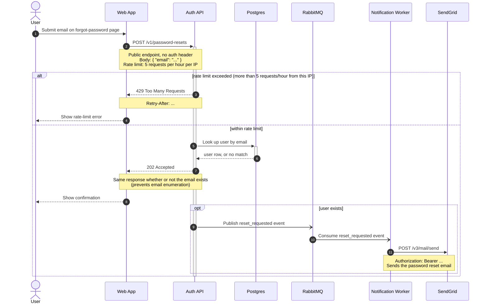

Here is the password reset flow as a Mermaid sequence diagram. Paste the block as-is into the GitLab wiki page; it uses only core Mermaid syntax, so GitLab's bundled renderer handles it.

Validated with the mermaid-cli Docker image (`minlag/mermaid-cli`): it parses and renders cleanly.

Walk-through: steps 1-2 are the submission and the public `POST /v1/password-resets` call. Steps 3-4 are the rate-limit branch (429 with `Retry-After`). Steps 5-8 are the normal path: the Postgres lookup and the unconditional `202 Accepted`, with the note spelling out why it is the same either way. Steps 9-11 only happen when the user exists: the `reset_requested` event goes to RabbitMQ, the Notification worker consumes it and calls SendGrid's `POST /v3/mail/send` with the Bearer token.

Three things I chose rather than took from your description, so you can adjust them:

- Steps 4 and 8, what the web app shows the user after a 429 or a 202, were not in your description. I drew generic "show error" / "show confirmation" replies; change the wording or drop them if the page behaves differently.
- SendGrid's response to `POST /v3/mail/send` is not drawn because you did not say what the worker does with it (or what happens if the send fails). If you want that on the diagram, tell me the status code the worker expects and how a failure is handled.
- I placed the 202 before the event publish. If the Auth API publishes to RabbitMQ before responding, swap steps 7 and 9.

The `Retry-After` value is left as `...` since you did not specify how it is computed.
