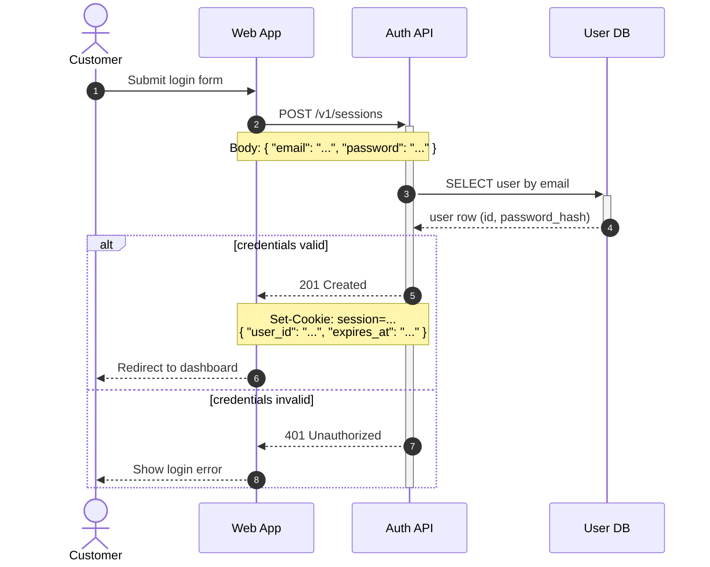

# Mermaid sequence diagrams

This skill turns a described or discovered interaction flow into a Mermaid sequence
diagram delivered as a fenced ` ```mermaid ` code block — ready to paste into any
Markdown file that GitHub, GitLab, and most wikis render natively — validated before
delivery and annotated with the technical details (endpoints, headers, payloads, status
codes) that make a diagram useful as documentation rather than decoration.

## The contract

These rules exist because a sequence diagram is documentation other people will trust.
A reader debugging an integration at 2 a.m. will believe the arrow, the status code,
and the payload field in the note — an invented one sends them down the wrong path.

1. **Never invent the flow.** Participants, message order, endpoints, methods, headers,
   payload fields, status codes, and timing all come from the user or from code you
   actually read. When something is missing or ambiguous, ask (step 2). Cosmetic choices
   (aliases, participant order, where a note sits) are yours to make.

2. **Failure paths are the easiest thing to fabricate — don't.** Real interactions fail:
   timeouts, 4xx/5xx, lost messages, rejected events. If the user hasn't said how a step
   fails or what handles the failure, do not make up an `alt`/`break` branch. Ask whether
   error handling belongs in the diagram and what actually happens; if they want the
   happy path only, say which failure points were deliberately left out.

   The rule cuts both ways: what the user *did* establish must be drawn. When a fact is
   stated but its mechanism is not ("the customer is notified" — but through what?),
   draw the fact with a reasonable mechanism and flag that choice in a note or in your
   hand-off — don't drop the established fact or stall on a question about plumbing.

3. **The deliverable is the code block.** A fenced ` ```mermaid ` block in the
   conversation — or written into a Markdown file when the user asks or when the
   diagram clearly belongs in the repo's docs. It must stand alone: anyone pasting it
   into GitHub, GitLab, or mermaid.live gets the diagram; rendered previews are a
   bonus, never a substitute.

4. **Annotate with real details, in notes.** Message text stays short — `POST
   /v1/sessions`, `201 Created` — and the substance (headers, payload shape, query
   params, token contents) goes into `Note` lines immediately after the message. Only
   established details; a note is a contract, not an illustration.

   Protocol boilerplate counts as an invented detail. `Content-Type: application/json`,
   `Accept`, charsets, `User-Agent` — they look too obvious to be wrong, which is
   exactly why they slip past rule 1. A reader debugging a 415 against a partner API
   that actually wants `application/vnd.api+json` pays for the guess. If the user or
   the code didn't state the header, leave it out.

5. **Validate before declaring done** (step 5): mermaid-cli through its Docker image
   first, a local mermaid-cli install second, and if neither is available say explicitly
   that the code was not validated and hand over the command. Validation never leaves the
   machine. Never imply a diagram was checked when it wasn't.

6. **Prefer portable syntax.** GitHub and GitLab bundle their own Mermaid versions,
   which lag the latest release. Stick to the safe core by default; use version-gated
   features (see the portability table in `references/syntax.md`) only when the user's
   renderer is known to support them — and say which minimum version they need.

Mermaid keywords are English (they are syntax). Message text, note text, and participant
labels follow the language the user used to describe their system.

## Workflow

### 1. Gather the flow

Three sources, in order of reliability:

- **Code in the repo.** When the flow exists in code, read it — routes, handlers,
  HTTP/queue clients, OpenAPI specs — and extract the real endpoints, methods, status
  codes, and payload fields. Don't ask the user what the code already answers.
- **The conversation.** The user may have just described or debugged this flow.
- **The user.** Whatever is still missing goes to step 2.

Before writing, assemble: the participants (and which are humans), the trigger, the
ordered messages with their returns, and the known failure points. Gaps become
questions.

### 2. Ask when vague

Ask 2–4 targeted questions in the conversation language — batched, not a drip-feed.
Pick from:

- Who participates, and which participants are people (rendered as `actor`) versus
  systems (`participant`)?
- What triggers the flow?
- Is each call request/response or fire-and-forget? (decides `->>` + reply vs `-)`)
- What does each call return on success?
- What happens when *step X* fails or times out — and should the diagram show it?
- Should notes carry the real endpoint/header/payload details, or stay conceptual
  (e.g., a public-facing doc that must not leak internals)?

Don't interrogate a user who already gave the substance, and don't ask what the repo
answers.

### 3. Write the diagram

Read `references/syntax.md` before writing — the full arrow/block/feature syntax plus
the text-escaping gotchas that produce parse errors far from the actual mistake.

House conventions, and why:

- **`autonumber`** — numbered arrows let your prose and the user's future discussions
  reference "step 4" unambiguously.
- **Declare every participant explicitly** at the top, in left-to-right order, with a
  short id and a readable alias: `participant api as Order API`. Implicit declaration
  scatters column order by first mention.
- **`actor` for humans**, `participant` for everything that runs.
- **Arrows mean things**: a reply is `-->>`, never a second `->>`; async
  fire-and-forget is `-)` — per the arrow table in syntax.md.
- **Activations** as `+`/`-` suffix pairs on request/reply — syntax.md has the
  deactivation pitfall when the reply sits inside an `alt`/`opt` branch, and its fix.
- **Notes carry the contract**: `Note over A,B:` for the message's technical details,
  `<br/>` for line breaks.
- **Blocks** (`alt`/`else`, `opt`, `loop`, `par`, `break`) per syntax.md — label each
  branch and loop with its condition.
- **`%%` comments** for context that helps the next editor of the source but shouldn't
  render.

A canonical example (validated with the mermaid-cli Docker image from step 5):



### 4. Split before it sprawls

A sequence diagram stops being readable long before Mermaid stops rendering it. When a
flow needs more than roughly **20 messages**, more than **7 participants**, or **3
levels of nested blocks**, split it into multiple smaller diagrams instead of delivering
one wall:

- **By phase** — authentication, then checkout, then fulfillment.
- **By scenario** — the happy path in one diagram; each meaningful failure mode in its
  own small diagram.
- **By zoom** — an overview diagram with coarse participants, then detail diagrams for
  the hops that deserve it.

Keep participant ids and labels identical across the set, give each diagram its own
heading and one-line introduction, and make continuity explicit ("continues from step 8
of the previous diagram" — as heading text or a `Note`). Deliver the set as one Markdown
document.

### 5. Validate — always, before declaring done

The validator is mermaid-cli (`mmdc`) rendering the diagram: exit 0 means it parses, a
non-zero exit with a parse message points at the line to fix. Everything runs on this
machine — the diagram is never sent to a remote service, so internal endpoints, headers,
and partner names are safe to validate. Use what the session already has, in this order,
and never install a package or a browser just to validate.

Write the diagram to `d.mmd` in a temp directory of its own (call it `$DIR` below — the
container mounts that directory), then:

1. **Docker.** When `docker` is on `PATH` and the daemon answers (`docker info` exits 0),
   run the official mermaid-cli image, pulled on first use like any image:

   ```
   docker run --rm -u "$(id -u):$(id -g)" -v "$DIR":/data minlag/mermaid-cli -i d.mmd -o d.svg
   ```

   The container reads input from `/data`, so mount the directory that holds the `.mmd`
   and pass paths relative to it; `-u` keeps the output owned by the user instead of
   root. `ghcr.io/mermaid-js/mermaid-cli/mermaid-cli` is the same image on GitHub's
   registry. With Podman instead:
   `podman run --userns keep-id --user "$UID" --rm -v "$DIR":/data:z ghcr.io/mermaid-js/mermaid-cli/mermaid-cli -i d.mmd -o d.svg`.
   - On a parse error, fix the diagram and re-run until it exits clean.
   - When the failure is environmental — daemon down, image can't be pulled, permission
     denied on the socket — Docker is unavailable here: fall through to 2. Don't try to
     repair the environment.
2. **Local mermaid-cli**, when Docker is unavailable and the CLI already exists
   (`command -v mmdc`, or `npx --no-install @mermaid-js/mermaid-cli --version`
   succeeds): `mmdc -i "$DIR/d.mmd" -o "$DIR/d.svg"`. A version probe is not proof of
   availability — mermaid-cli renders through a headless browser (puppeteer) and can
   print a version yet fail with "Could not find Chrome" at render time. The render
   attempt itself is the real check: if it fails for environmental reasons (missing
   browser) rather than diagram syntax, treat the CLI as unavailable and fall through
   to 3. Don't install anything (package or browser) just to validate.
3. **Neither available**: deliver the code block and say plainly that it was **not
   validated here**, then hand the user the Docker command from step 1 so they can run it
   themselves. GitHub/GitLab render ` ```mermaid ` blocks natively, so the repo's own
   Markdown preview is the private way to see it. <https://mermaid.live> also previews
   and edits the code, but it renders remotely: offer it when the diagram carries nothing
   internal, and when it does (endpoints, headers, field names, partner names) say so and
   leave that choice to the user — it is their content.

Steps 1 and 2 produce no inline preview; say which validator ran ("validated with the
mermaid-cli Docker image" / "validated with the local mermaid-cli") and don't report
output you didn't get.

### 6. Hand off

- The fenced code block(s) — or the path of the Markdown file you wrote.
- The validation notice: which validator ran (step 5.1 or 5.2), or the "not validated
  here" notice with the Docker command (step 5.3).
- A sentence or two walking the reader through the flow by step number — not a
  paragraph per arrow.

## Reference files

| File | Read it when |
|---|---|
| `references/syntax.md` | Always, before writing diagram code — arrows, blocks, participant types, escaping gotchas, and the version-portability table. |

## Attribution

Syntax and feature documentation are condensed from the Mermaid project documentation
([mermaid.js.org](https://mermaid.js.org), MIT License). See `NOTICE.md`.
