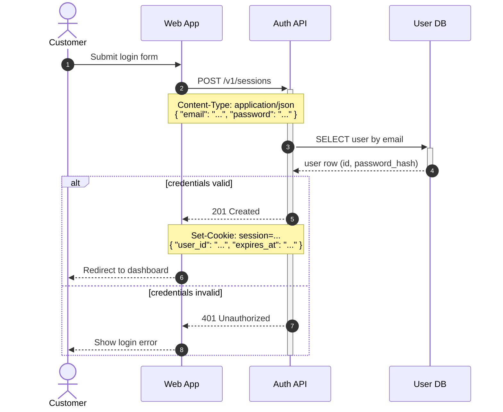

# Mermaid sequence diagrams

This skill turns a described or discovered interaction flow into a Mermaid sequence
diagram delivered as a fenced ` ```mermaid ` code block — ready to paste into any
Markdown file that GitHub, GitLab, and most wikis render natively — validated before
delivery and annotated with the technical details (endpoints, headers, payloads, status
codes) that make a diagram useful as documentation rather than decoration.

## The contract

These rules exist because a sequence diagram is documentation other people will trust.
A reader debugging an integration at 2 a.m. will believe the arrow, the status code,
and the payload field in the note — an invented one sends them down the wrong path.

1. **Never invent the flow.** Participants, message order, endpoints, methods, headers,
   payload fields, status codes, and timing all come from the user or from code you
   actually read. When something is missing or ambiguous, ask (step 2). Cosmetic choices
   (aliases, participant order, where a note sits) are yours to make.

2. **Failure paths are the easiest thing to fabricate — don't.** Real interactions fail:
   timeouts, 4xx/5xx, lost messages, rejected events. If the user hasn't said how a step
   fails or what handles the failure, do not make up an `alt`/`break` branch. Ask whether
   error handling belongs in the diagram and what actually happens; if they want the
   happy path only, say which failure points were deliberately left out.

   The rule cuts both ways: what the user *did* establish must be drawn. When a fact is
   stated but its mechanism is not ("the customer is notified" — but through what?),
   draw the fact with a reasonable mechanism and flag that choice in a note or in your
   hand-off — don't drop the established fact or stall on a question about plumbing.

3. **The deliverable is the code block.** A fenced ` ```mermaid ` block in the
   conversation — or written into a Markdown file when the user asks or when the diagram
   clearly belongs in the repo's docs. It must stand alone: anyone pasting it into
   GitHub, GitLab, or mermaid.live gets the diagram. Rendered previews are a bonus on
   top, never a substitute for the code.

4. **Annotate with real details, in notes.** Message text stays short — `POST
   /v1/sessions`, `201 Created` — and the substance (headers, payload shape, query
   params, token contents) goes into `Note` lines next to the message. Only details that
   were established; a note is a contract, not an illustration.

5. **Validate before declaring done** (step 5): Mermaid MCP first, mermaid-cli second,
   and if neither is available say explicitly that the code was not validated. Never
   imply a diagram was checked when it wasn't.

6. **Prefer portable syntax.** GitHub and GitLab bundle their own Mermaid versions,
   which lag the latest release. Stick to the safe core by default; use version-gated
   features (see the portability table in `references/syntax.md`) only when the user's
   renderer is known to support them — and say which minimum version they need.

Mermaid keywords are English (they are syntax). Message text, note text, and participant
labels follow the language the user used to describe their system.

## Workflow

### 1. Gather the flow

Three sources, in order of reliability:

- **Code in the repo.** When the flow exists in code, read it — routes, handlers,
  HTTP/queue clients, OpenAPI specs — and extract the real endpoints, methods, status
  codes, and payload fields. Don't ask the user what the code already answers.
- **The conversation.** The user may have just described or debugged this flow.
- **The user.** Whatever is still missing goes to step 2.

Before writing, assemble: the participants (and which are humans), the trigger, the
ordered messages with their returns, and the known failure points. Gaps become
questions.

### 2. Ask when vague

Ask 2–4 targeted questions in the conversation language — batched, not a drip-feed.
Pick from:

- Who participates, and which participants are people (rendered as `actor`) versus
  systems (`participant`)?
- What triggers the flow?
- Is each call request/response or fire-and-forget? (decides `->>` + reply vs `-)`)
- What does each call return on success?
- What happens when *step X* fails or times out — and should the diagram show it?
- Should notes carry the real endpoint/header/payload details, or stay conceptual
  (e.g., a public-facing doc that must not leak internals)?

Don't interrogate a user who already gave the substance, and don't ask what the repo
answers. One round of good questions beats three rounds of small ones.

### 3. Write the diagram

Read `references/syntax.md` before writing — the full arrow/block/feature syntax plus
the text-escaping gotchas (the literal word `end`, angle brackets, semicolons) that
produce parse errors far from the actual mistake.

House conventions, and why:

- **`autonumber`** — numbered arrows let your prose and the user's future discussions
  reference "step 4" unambiguously.
- **Declare every participant explicitly** at the top, in left-to-right order, with a
  short id and a readable alias: `participant api as Order API`. Implicit declaration
  scatters column order by first mention.
- **`actor` for humans**, `participant` for everything that runs.
- **Arrow semantics**: `->>` request, `-->>` reply (dotted = "going back"), `-)` async
  fire-and-forget, `-x` message that is never received. A reply drawn as `->>` reads as
  a new request.
- **Activations** as `+`/`-` suffix pairs on request/reply. When the reply happens
  inside an `alt`/`opt` (each branch replies), deactivate with an explicit
  `deactivate X` line after the block's `end` — a `-` in every branch deactivates twice
  and fails to parse.
- **Notes carry the contract**: `Note over A,B:` for the message's technical details,
  `<br/>` for line breaks. Put the note immediately after the message it describes.
- **Blocks**: `alt`/`else` for branching outcomes, `opt` for optional steps, `loop` for
  repetition (label it with the condition), `par` for concurrency, `break` for early
  exits/exceptions.
- **`%%` comments** for context that helps the next editor of the source but shouldn't
  render.

A canonical example (validated — render at <https://l.mermaid.ai/Ogs4Y3>):



### 4. Split before it sprawls

A sequence diagram stops being readable long before Mermaid stops rendering it. When a
flow needs more than roughly **20 messages**, more than **7 participants**, or **3
levels of nested blocks**, split it into multiple smaller diagrams instead of delivering
one wall:

- **By phase** — authentication, then checkout, then fulfillment.
- **By scenario** — the happy path in one diagram; each meaningful failure mode in its
  own small diagram.
- **By zoom** — an overview diagram with coarse participants, then detail diagrams for
  the hops that deserve it.

Keep participant ids and labels identical across the set, give each diagram its own
heading and one-line introduction, and make continuity explicit ("continues from step 8
of the previous diagram" — as heading text or a `Note`). Deliver the set as one Markdown
document.

### 5. Validate — always, before declaring done

1. **Mermaid MCP.** Check for connected Mermaid MCP tools (e.g. via ToolSearch — names
   contain "mermaid"). The official hosted server (`mcp.mermaid.ai`) exposes
   `validate_and_render_mermaid_diagram`: pass the diagram as `mermaidCode`,
   `diagramType: "sequenceDiagram"`, a one-line `prompt`, and `clientName: "claude"`.
   - On error, the tool returns the parse message — fix and re-validate until clean.
   - On success it returns a PNG preview (it renders inline in the conversation) and a
     **Preview/Edit link** — include that link in your final answer.
   - The tool output ends with title/summary-generation boilerplate; ignore it unless
     the user asked for a title.
   - The hosted server renders remotely: for flows whose details are sensitive, prefer
     the local CLI fallback and tell the user why.
2. **mermaid-cli**, when no MCP is connected and the CLI already exists locally
   (`command -v mmdc`, or `npx --no-install @mermaid-js/mermaid-cli --version`
   succeeds): write the diagram to a temp `.mmd` file and render it
   (`mmdc -i /tmp/d.mmd -o /tmp/d.svg`); exit 0 means it parses. A version probe is not
   proof of availability — mermaid-cli renders through a headless browser (puppeteer)
   and can print a version yet fail with "Could not find Chrome" at render time. The
   render attempt itself is the real check: if it fails for environmental reasons
   (missing browser) rather than diagram syntax, treat the CLI as unavailable and fall
   through to 3. Don't install anything (package or browser) just to validate. There is
   no inline preview — say the diagram was validated locally.
3. **Neither available**: deliver the code block and say plainly that it was **not
   validated here** — but that GitHub/GitLab render ` ```mermaid ` blocks natively, and
   the user can paste the code into <https://mermaid.live> to preview and edit it.

### 6. Hand off

- The fenced code block(s) — or the path of the Markdown file you wrote.
- The preview link (MCP) or the validation/fallback notice (steps 5.2–5.3).
- A sentence or two walking the reader through the flow by step number — not a
  paragraph per arrow.

## Reference files

| File | Read it when |
|---|---|
| `references/syntax.md` | Always, before writing diagram code — arrows, blocks, participant types, escaping gotchas, and the version-portability table. |

## Attribution

Syntax and feature documentation are condensed from the Mermaid project documentation
([mermaid.js.org](https://mermaid.js.org), MIT License). See `NOTICE.md`.
